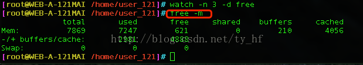

我们一起看下面的一个输出：

free –m 表示以 M 为单位查看内存使用情况，在这个输出中，我们 重点关注的应该是 free 列与 cached 列的输出值

由输出可知，此系统共 7.8G 内存，系统空闲内存还有 621M，其中，Buffer Cache 占用了 210M，Page Cache 占用了 4056M，由此可知系统缓存了很多的文件和目录，而对于应用程序来说，可以使用的内存还有 4888M，当然这个 4888M 包含了 Buffer Cache 和 Page Cache 的值。在 swap 项可以看出，交换分区还未使用。所以从应用的角度来说，此系统内存资源还非常充足。 

一般有这样一个经验公式：

应用程序可用内存/系统物理内存>70% 时，表示系统内存资源非常充足，不影响系统性能，

应用程序可用内存/系统物理内存<20% 时，表示系统内存资源紧缺，需要增加系统内存，

20%<应用程序可用内存/系统物理内存<70% 时，表示系统内存资源基本能满足应用需求，暂时不影响系统性能。

（比如上图，4888/7869=0.621，所以基本满足性能）

tips:

watch 是一个非常有用的命令，几乎每个 linux 发行版都带有这个工具，通过 watch，可以动态的监控命令的运行结果，省去手动执行的麻烦。)

 例如：

在【watch】后面跟上需要运行的命令， watch 就会自动重复去运行这个命令 ，默认是 2 秒钟执行一次，并把执行的结果更新在屏幕上。

-n: 指定重复执行的时间

-d: 表示高亮显示变动。
