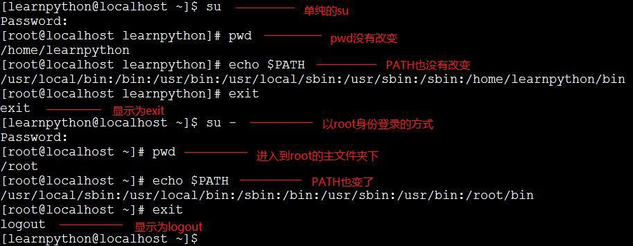
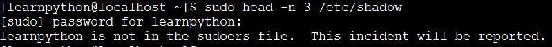
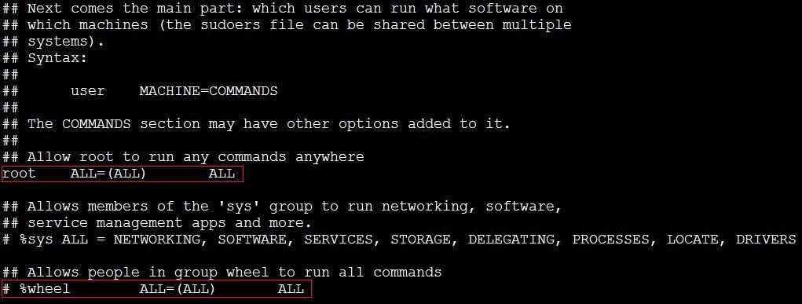
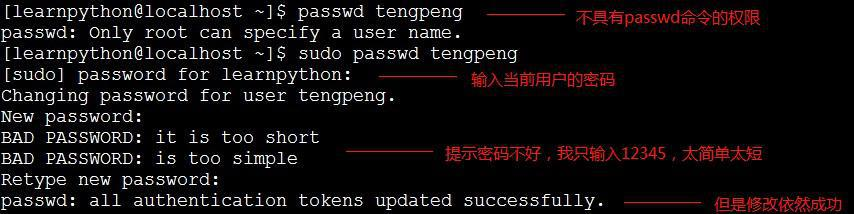
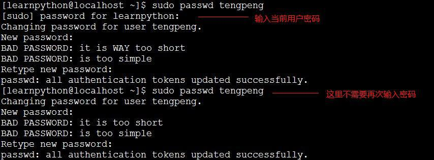

我们都知道很多的文件都只有 root 有权限来修改，那么在我们平时的开发过程中都建议使用一般账号来登录进行开发，还记得前面说到的 ssh 吗，我们也是将允许 root 登录设置成 no，到必要的时候再切换到 root 来进行操作，这样就不至于有风险。那么我们如何切换身份呢。

1.su

su 是最简单的身份切换名，用 su 我们可以进行任何用户的切换，一般都是 su - username，然后输入密码就 ok 了，但是 root 用 su 切换到其他身份的时候是不需要输入密码的。起初我都是用 su 来切换的，后来老大看见了说我这种方式切换是不好的，你可以尝试其他的方式来切换。我觉得这样切换很方便啊，那到底是不好在哪里呢，后面再看第二种身份的切换方式就知道了。

一般我们切换身份都是切换到 root，然后进行一些只有 root 能干的事，比如修改配置文件，比如下载安装软件，这些都只能是 root 才有权限干的事，切换到 root 可以是单纯的 su，或者是 su - 和 su - root，后面两个是一样的意思。

单纯使用 su 切换到 root，读取变量的方式是 non-login shell，这种方式下很多的变量都不会改变，尤其是 PATH，所以 root 用的很多的命令都只能用绝对路径来执行，这种方式只是切换到 root 的身份。而用 su - 这种方式的话，是 login shell 方式，它是先以 root 身份登录然后再执行别的操作。

如果我们只要切换到 root 做一次操作就好了，只要在 su 后面加个 -c 参数就好了，执行完这次操作后，又会自动切换回我们自己的身份，很方便。

那么如果有很多人管理这个主机的话，那不是很多人都要知道 root 的密码吗，而且可能有的人只是单纯的进行一次 root 操作就可以了，这个时候，su 方式就不是很好，root 密码越少人知道越好，越少人知道就越安全，这时就需要第二种方式了。

2.sudo

相比于 su 切换身份需要用户的密码，经常性的是需要 root 密码，sudo 只是需要自己的密码，就可以以其他用户的身份来执行命令，经常是以 root 的身份执行命令，也并非所有人都可以用 sudo：

这里我要查看/etc/shadow 这个文件的前三行，但是却发现看不了，提示的错误是说我当前这个用户不在 sudoers 这个文件，所以 sudo 是依赖于/etc/sudoers 这个配置文件的。sudo 的执行有这样一个流程：

1).当用户执行 sudo 时，[系统](http://www.2cto.com/os/) 于/etc/sudoers 文件中查找该用户是否有执行 sudo 的权限；

2).若用户具有可执行 sudo 的权限，那么让用户输入用户自己的密码，注意这里输入的是用户自己的密码；

3).如果密码正确，变开始进行 sudo 后面的命令，root 执行 sudo 是不需要输入密码的，切换到的身份与执行者身份相同的时候，也不需要输入密码。

下面看看/etc/sudoers 这个配置文件：

为何刚开始只有 root 能执行 sudo，切换到 root 身份通过 visudo 查看/etc/sudoers 这个配置文件，如果是 vim /etc/sudoers 是可以查看的，但是不能修改，因为 sudoers 这个文件是由语法的，只能通过 visudo 来修改。第一个红色方框那行代码，这行代码是什么意思呢，第一列 root 不用多说，是用户账号，第二列的 ALL 意思是登陆者的来源主机名，第三列等号右边小括号中的 ALL 是代表可以切换的身份，第四列 ALL 是可执行的命令。

1).单个用户的 sudoers 语法：

如果我要我当前这个用户能执行 root 的所有操作，那么我只要加一行 learnpython ALL=(ALL) ALL。那么如果有很多人需要执行 sudo，那不是要写编写很多行啊，这样不是很麻烦，这样就要用到用户组了。

2).利用用户组处理 visudo：

看看第二个红色方框那行代码，%wheel 代表 wheel 用户组，如果我们将需要执行 root 所有操作的用户都加入到 wheel 用户组，或者我们自定义的用户组，然后添加一行代码，那么就不用一个用户一个用户的添加进来了，这样不是很省事啊。

3).限制用户 sudo 的权限：

但是经常我们不需要用户有那么大的权限，只要让他们具有他们负责范围的权限就可以了，比如有的有的人来管理密码，我们就只让他能进行密码的管理，而不让他有别的权限，这样就需要权限的控制了。如果我让我当前用户来管理密码，即 learnpython 这个用户能使用 passwd 这个命令来帮 root 修改用户密码，只要加这行 learnpython ALL=(root) /usr/bin/passwd，那么 learnpython 这个用户就可以使用 passwd 这个命令了：

但是如果只是执行 sudo passwd 命令，修改的就是 root 的密码，当然我们不希望普通用户能具有修改 root 密码的权限，那么在 visudo 的时候就需要将命令的参数限制好，如改成这样：

[root@localhost ~]# visudo learnpython ALL=(root) !/usr/bin/passwd, /usr/bin/passwd [A-Za-z]*, !/usr/bin/passwd root

4).通过别名设置 visudo

查看 sudoers 这个文件的时候，你会看见 User_Alias，Host_Alias 和 Cmnd_Alias 这些东西，他们都是一些别名，User_Alias 表示具有 sudo 权限的用户列表，就是第一列参数，Host_Alias 表示主机的列表，就是第二列参数，Cmnd_Alias 表示允许执行命令的列表，就是第四列参数，还有个 Runas_Alias，我初始的 sudoers 里是没有的，这个表示用户以什么身份登录，也就是第三列参数。

所以如果有几个密码管理员的话就可以加上如下代码：

[root@localhost ~]# visudo User_Alias PWMNG = manager1, manager2, manager3 Cmnd_Alias PWCMD = !/usr/bin/passwd, /usr/bin/passwd [A-Za-z]*, !/usr/bin/passwd root PWMNG ALL=(root) PWCMD

5).sudo 搭配 su

从上面来看，我们都只是切换到别的用户然后执行命令，接着就切回到我们自己的用户了，如果我们要像 su 那样直接切换到 root，然后干自己想干的，这个时候，就要将命令修改成/bin/su -，如下：

[root@localhost ~]# visudo User_Alias ADMINS = user1, user2, user3 ADMINS ALL=(root) /bin/su -

当然这个是需要慎重了，因为这样用户 user1，user2，user3 等就直接切换到 root 了，切换后他们就是老大了。

有没有发现，当我们连续使用 sudo 的时候，在一定时间内是不用再次输入我们的密码，这个其实是系统自己设定的，在五分钟之内执行 sudo 只需要输入一次密码就可以了。

3.总结

了解完 su 和 sudo，是不是发现 sudo 有太多的好处了。su 方式切换是需要输入目标用户的密码，而 sudo 只需要输入自己的密码，所以 sudo 可以保护目标用户的密码不外流的。当帮 root 管理系统的时候，su 是直接将 root 所有权利交给用户，而 sudo 可以更好分工，只要配置好/etc/sudoers，这样 sudo 可以保护系统更安全，而且分工明确，有条不紊。
