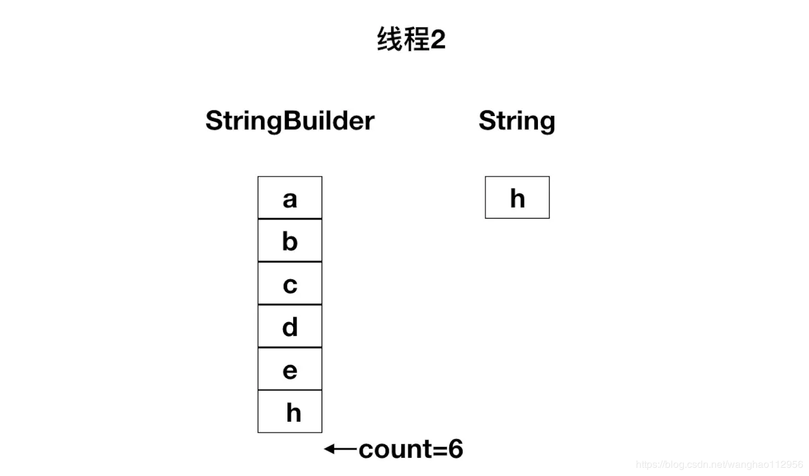

周五去面试又被面试的一个问题问哑巴了

面试官：StringBuilder 和 StringBuffer 的区别在哪？

我：StringBuilder 不是线程安全的，StringBuffer 是线程安全的

面试官：那 StringBuilder 不安全的点在哪儿？

我：。。。（哑巴了）

在这之前我只记住了 StringBuilder 不是线程安全的，StringBuffer 是线程安全的这个结论，至于 StringBuilder 为什么不安全从来没有去想过。

（想自学习编程的小伙伴请搜索 [圈T社区](http://www.aiquanti.com)，更多行业相关资讯更有行业相关免费视频教程。完全免费哦!）

分析

在分析设个问题之前我们要知道 StringBuilder 和 StringBuffer 的内部实现跟 String 类一样，都是通过一个 char 数组存储字符串的，不同的是 String 类里面的 char 数组是 final 修饰的，是不可变的，而 StringBuilder 和 StringBuffer 的 char 数组是可变的。

首先通过一段代码去看一下多线程操作 StringBuilder 对象会出现什么问题

```java
public class StringBuilderDemo {

    public static void main(String[] args) throws InterruptedException {
        StringBuilder stringBuilder = new StringBuilder();
        for (int i = 0; i < 10; i++){
            new Thread(new Runnable() {
                @Override
                public void run() {
                    for (int j = 0; j < 1000; j++){
                        stringBuilder.append("a");
                    }
                }
            }).start();
        }

        Thread.sleep(100);
        System.out.println(stringBuilder.length());
    }

}
```

复制代码我们能看到这段代码创建了 10 个线程，每个线程循环 1000 次往 StringBuilder 对象里面 append 字符。正常情况下代码应该输出 10000，但是实际运行会输出什么呢？


我们看到输出了“9326”，小于预期的 10000，并且还抛出了一个 ArrayIndexOutOfBoundsException 异常（异常不是必现）。

1、为什么输出值跟预期值不一样

我们先看一下 StringBuilder 的两个成员变量（这两个成员变量实际上是定义在 AbstractStringBuilder 里面的，StringBuilder 和 StringBuffer 都继承了 AbstractStringBuilder）

```java
//存储字符串的具体内容 
char[] value; 
//已经使用的字符数组的数量 
int count;
```

再看 StringBuilder 的 append() 方法：

```java
@Override
public StringBuilder append(String str) {
    super.append(str);
    return this;
}
```

StringBuilder 的 append() 方法调用的父类 AbstractStringBuilder 的 append() 方法

```java
public AbstractStringBuilder append(String str) {
    if (str == null)
        return appendNull();
    int len = str.length();
    ensureCapacityInternal(count + len);
    str.getChars(0, len, value, count);
    count += len;
    return this;
}
```

我们先不管代码的第五行和第六行干了什么，直接看第七行，count += len 不是一个原子操作。假设这个时候 count 值为 10，len 值为 1，两个线程同时执行到了第七行，拿到的 count 值都是 10，执行完加法运算后将结果赋值给 count，所以两个线程执行完后 count 值为 11，而不是 12。这就是为什么测试代码输出的值要比 10000 小的原因。

2、为什么会抛出 ArrayIndexOutOfBoundsException 异常。

我们看回 AbstractStringBuilder 的 append() 方法源码的第五行，ensureCapacityInternal() 方法是检查 StringBuilder 对象的原 char 数组的容量能不能盛下新的字符串，如果盛不下就调用 expandCapacity() 方法对 char 数组进行扩容。

```java
private void ensureCapacityInternal(int minimumCapacity) {
        // overflow-conscious code
    if (minimumCapacity - value.length > 0)
        expandCapacity(minimumCapacity);
}
```

扩容的逻辑就是 new 一个新的 char 数组，新的 char 数组的容量是原来 char 数组的两倍再加 2，再通过 System.arryCopy() 函数将原数组的内容复制到新数组，最后将指针指向新的 char 数组。

```java
void expandCapacity(int minimumCapacity) {
    //计算新的容量
    int newCapacity = value.length * 2 + 2;
    //中间省略了一些检查逻辑
    …
    value = Arrays.copyOf(value, newCapacity);
}
```

Arrys.copyOf() 方法

```java
public static char[] copyOf(char[] original, int newLength) {
    char[] copy = new char[newLength];
    //拷贝数组
    System.arraycopy(original, 0, copy, 0,
                         Math.min(original.length, newLength));
    return copy;
}
```

AbstractStringBuilder 的 append() 方法源码的第六行，是将 String 对象里面 char 数组里面的内容拷贝到 StringBuilder 对象的 char 数组里面，代码如下：

```java
str.getChars(0, len, value, count);
```

getChars() 方法

```java
public void getChars(int srcBegin, int srcEnd, char dst[], int dstBegin) {
    //中间省略了一些检查
    …   
    System.arraycopy(value, srcBegin, dst, dstBegin, srcEnd - srcBegin);
    }
```

拷贝流程见下图


假设现在有两个线程同时执行了 StringBuilder 的 append() 方法，两个线程都执行完了第五行的 ensureCapacityInternal() 方法，此刻 count=5。


这个时候线程 1 的 cpu 时间片用完了，线程 2 继续执行。线程 2 执行完整个 append() 方法后 count 变成 6 了



线程 1 继续执行第六行的 str.getChars() 方法的时候拿到的 count 值就是 6 了，执行 char 数组拷贝的时候就会抛出 ArrayIndexOutOfBoundsException 异常。

至此，StringBuilder 为什么不安全已经分析完了。如果我们将测试代码的 StringBuilder 对象换成 StringBuffer 对象会输出什么呢？


当然是输出 10000 啦！

那么 StringBuffer 用什么手段保证线程安全的？这个问题你点进 StringBuffer 的 append() 方法里面就知道了。
