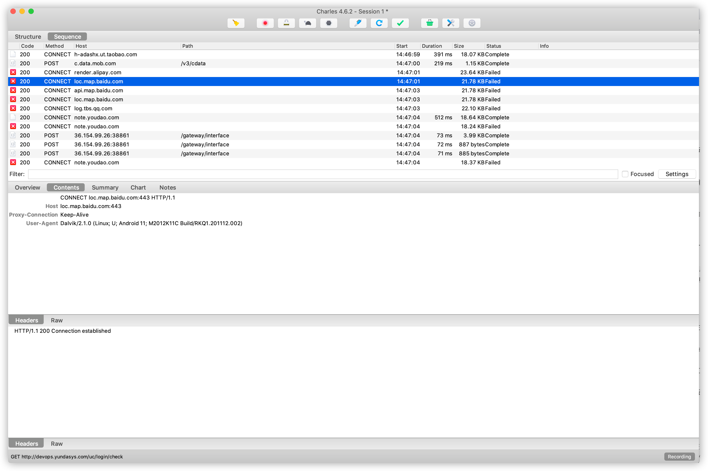
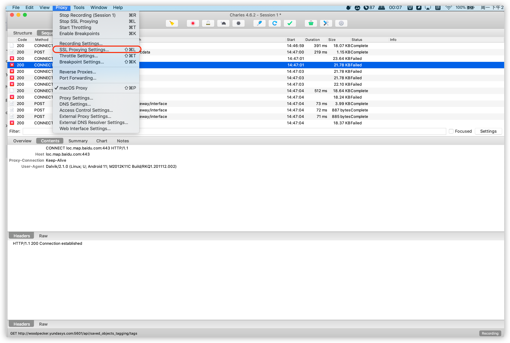
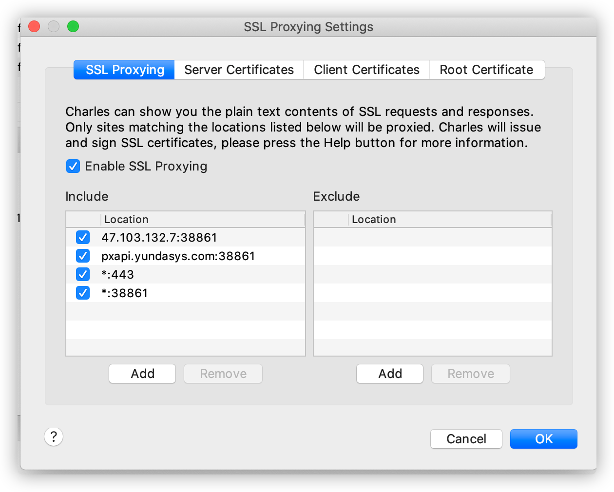
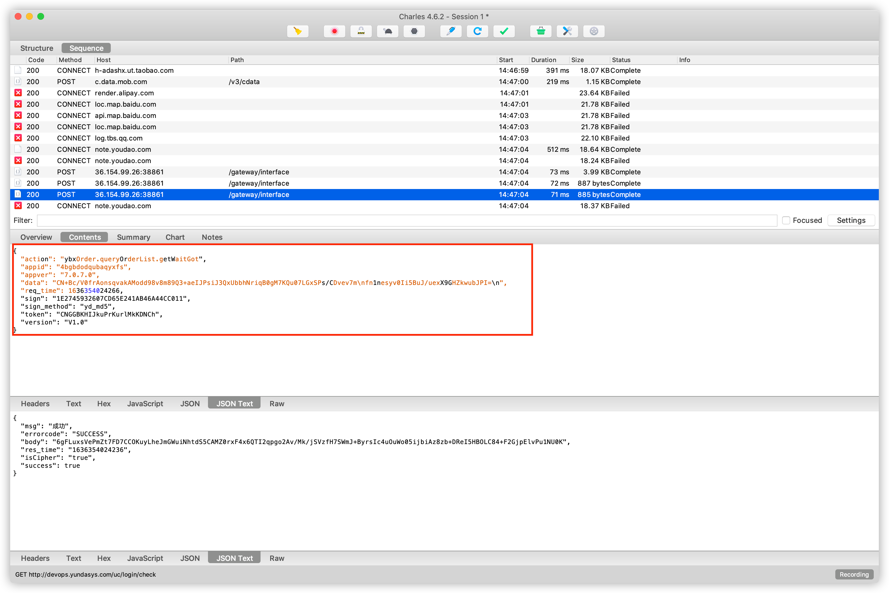

[https://cloud.tencent.com/developer/article/1473768](https://cloud.tencent.com/developer/article/1473768)

导言

Charles 是一个网络抓包工具，我们可以用它来做 App 的抓包分析，获取 App 运行过程中发生的所有网络请求和响应内容，这就和 Web 端浏览器的 [开发者工具](https://cloud.tencent.com/product/cclid?from=10680) Network 部分看到的结果一致。

相比 Fiddler 来说，Chrales 的功能更强大，而且跨平台支持更好。所以我们选用 Charles 作为主要的移动端抓包工具，用于分析移动的 App 数据包，辅助完成 App 数据的抓取工作。

目标

我们以京东 App 为例，通过 Charles 抓取 App 运行过程中的网络数据包，然后查看具体的 Resquest 和 Response 内容，以此来了解 Charles 的用法。

准备工作

请确保已经正确安装 Charles 并开启了代理服务，手机和 Charles 处于同一个局域网下，Charles 代理和 CharlesCA 证书设置好，具体的配置可以上网找教程。

原理

首先 Charles 运行在自己的 PC 上，Charles 运行的时候会在 PC 的 8888 端口开启一个代理服务，这个服务实际上是一个 HTTP/HTTPS 代理。

确保手机和 PC 在同一局域网内，我们可以使用手机模拟器通过虚拟网络连接，也可以使用手机真机和 PC 通过无线网络连接。

设置手机代理为 Charles 的代理地址，这样手机访问互联网的数据包就会流经 Charles，Charles 再转发这些数据包到真实服务器，服务器返回的数据包再由 Charles 转发回手机，Charles 就起到中间人的作用，所有流量包都可以捕捉到，因此所有 HTTP 请求和响应都可以捕捉到。同时 Charles 还有权力对请求和响应进行修改。

抓包

初始状态下 Charles 的运行界面如图所示。

Charles 会一直监听 PC 和手机发生的网络数据包，捕获到的数据包就会显示在左侧，随着时间的推移，捕获的数据包越来越多，左侧列表的内容也会越来越多。

可以看到，图中左侧显示了 Charles 抓取到的请求站点，我们点击任意一个条目便可以查看对应请求的详细信息，其中包括 Request、Response 等内容。

接下来清空 Charles 的抓取结果，点击左侧的扫帚按钮即可清空当前捕获到的所有请求。然后确保第二个监听按钮是打开的，显示红色就是打开的状态，这表示 Charles 正在监听 App 的网络包数据流。

这时打开手机京东，注意一定要提前设置好 Charles 代理并配置好 CA 证书，否则没有效果。打开任意一个商品，然后打开它的商品评论页面，不断上拉加载评论，可以看到 Charles 捕获到这个过程中京东 App 内发生的所有网络请求，如图所示。

左侧列表中会出现一个 api.m.jd.com 链接，而且它在不停的闪动，很可能就是当前 App 发出的获取评论数据的请求被 Charles 捕获到了。我们点击将其展开，继续上拉刷新评论。随着上拉的进行，此处有会出现一个个网络请求记录，这时新出现的数据包请求确定就是获取评论的请求。

为了验证其正确性，我们点击查看其中一个条目的详情信息，切换到 Contents 选项卡，这时我们发现数据乱码，如图所示。

这个问题我也试了好多种办法，直接给出正确的解决方案，点击 Proxy，SSL Proxy Settings，如图所示。

点击 Add，如图所示。

Host 填写 *，Port 就填写 HTTPS 的端口：443，然后点击 OK 确认修改接着重启 Charles 即可。

我们重复之前的步骤，如图所示。

可以发现，没有出现乱码了，这是我们发现一些 JSON 数据，核对一下结果，结果有 commentData 字段，其内容和我们在 App 中看到的内容一致。

这时可以确定，此请求对应的接口就是获取商品评论的接口。这样我们就成功捕获到了在上拉刷新过程中发生的请求和响应的内容。

使用过滤 Filter

[https://36.154.99.26:38861/gateway/interface](https://36.154.99.26:38861/gateway/interface)

