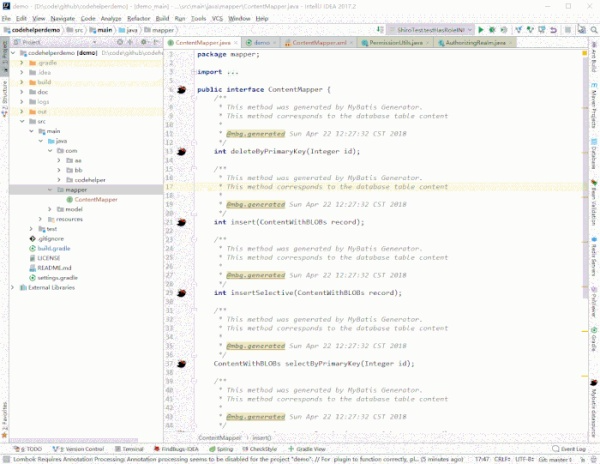
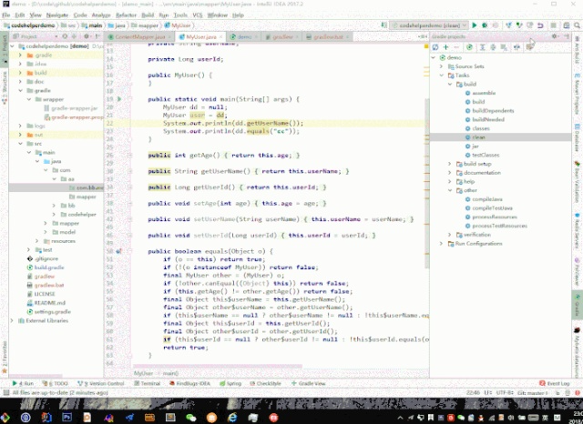
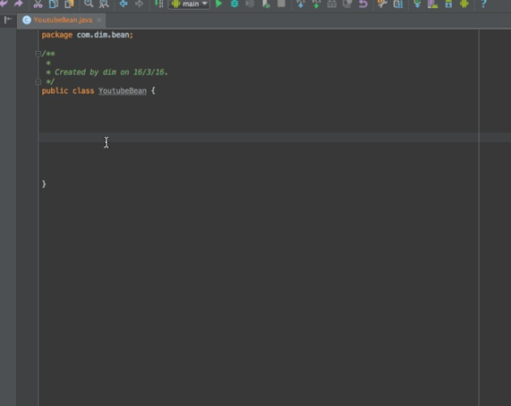
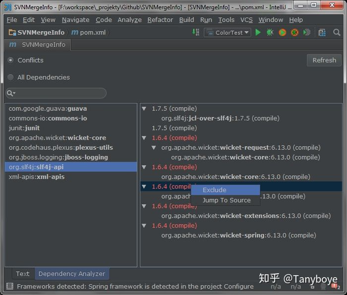
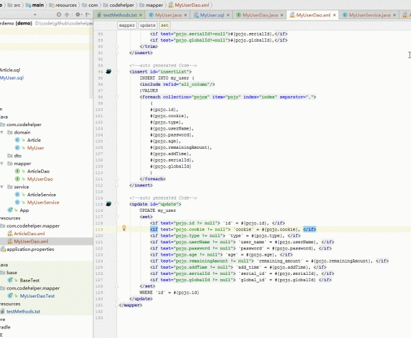

善用Intellij插件可大幅提升我们的效率

以下是我用过不错的Intellij插件

1. .ignore

生成各种ignore文件，一键创建git ignore文件的模板，免得自己去写

2. lombok

支持lombok的各种注解，从此不用写getter setter这些 可以把注解还原为原本的java代码 非常方便

3. p3c

阿里巴巴出品的java代码规范插件

可以扫描整个项目 找到不规范的地方 并且大部分可以自动修复

更多可看: [https://github.com/alibaba/p3c/tree/master/idea-plugin](https://link.zhihu.com/?target=https%3A//github.com/alibaba/p3c/tree/master/idea-plugin)

4. FindBugs-IDEA

检测代码中可能的bug及不规范的位置，检测的模式相比p3c更多，

写完代码后检测下 避免低级bug，强烈建议用一下，一不小心就发现很多老代码的bug

5. GsonFormat

一键根据json文本生成java类 非常方便

6. Maven Helper

一键查看maven依赖，查看冲突的依赖，一键进行exclude依赖

对于大型项目 非常方便

7. VisualVM Launcher

运行java程序的时候启动visualvm，方便查看jvm的情况 比如堆内存大小的分配

某个对象占用了多大的内存，jvm调优必备工具

8. GenerateAllSetter

一键调用一个对象的所有set方法并且赋予默认值 在对象字段多的时候非常方便

9. MyBatisCodeHelperPro

mybatis代码自动生成插件，大部分单表操作的代码可自动生成 减少重复劳动 大幅提升效率

介绍视频:[https://www.bilibili.com/video/av23458308/](https://link.zhihu.com/?target=https%3A//www.bilibili.com/video/av23458308/)

10. Translation

最好用的翻译插件，功能很强大，界面很漂亮

以上插件均可在Intellij 插件市场中搜索到 或者 点击插件名字的链接 从硬盘安装插件