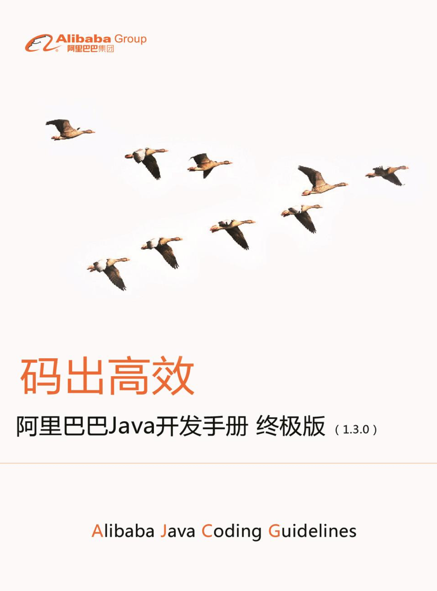
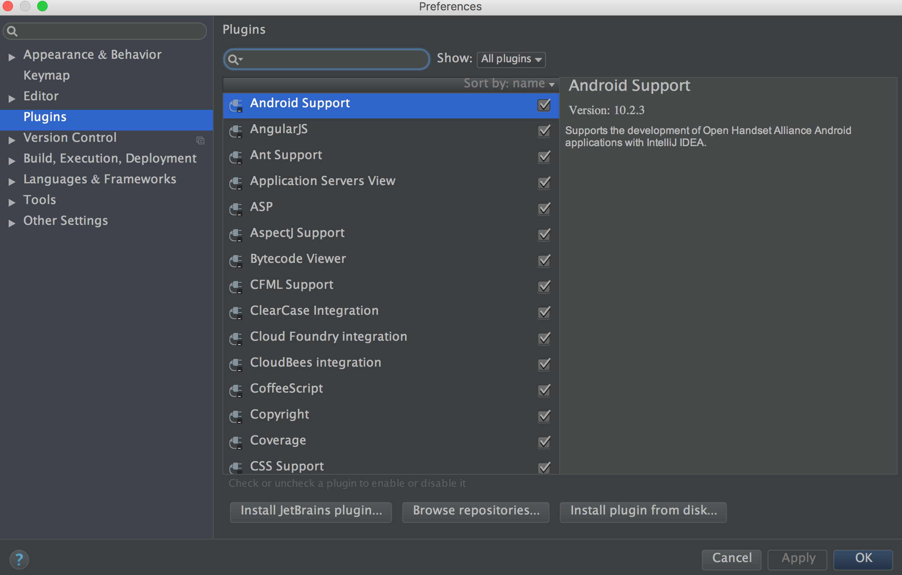
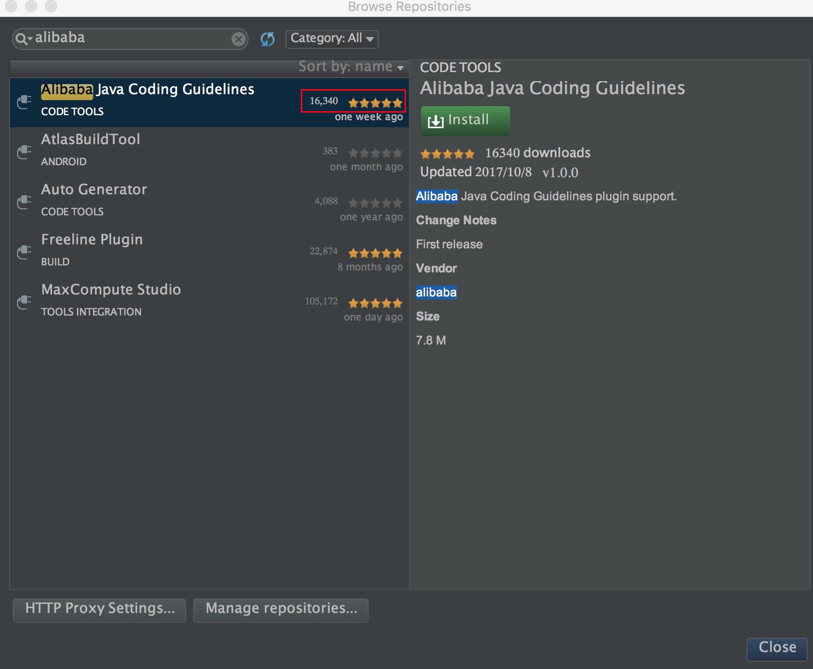

阿里巴巴Java开发手册

在进入正题介绍这款插件之前，首先来谈一下《阿里巴巴Java开发手册》，2017年年初，首次公开的阿里官方Java代码规范标准手册可以说是引起了全民(IT界)代码规范的热潮，相信这个手册很多行业内的朋友都比较熟悉，毕竟有"大厂光环"，想低调都难，这个手册的愿景是:

"统一规范标准将有助于提高行业编码规范化水平，帮助行业人员提高开发质量和效率、大大降低代码维护成本"

至今为止已更迭了三个版本，2017年9月25日，《阿里巴巴Java开发手册（终极版）》正式发布,也是阿里官方对外发布的最后一个PDF版本。最新版下载地址[在这里](http://www.cnblogs.com/han-1034683568/p/7680354.html)。

插件介绍

《阿里巴巴Java开发手册》自从第一个版本起，倍受业界关注，相信很多人对其中的规则也有了一定的了解，很多人甚至希望能尽快在自己的团队推行起来，这样大家有了一套共同的开发准则。但是，如何更好的去遵守规则并且按照手册去开发我们的系统确变得不那么容易，为了让开发者更加方便、快速的将规范推动并实行起来，阿里巴巴基于手册内容，研发了一套自动化的IDE检测插件（IDEA、Eclipse）， 该插件在扫描代码后，将不符合《手册》的代码按Blocker/Critical/Major三个等级显示在下方，甚至在IDEA上，还基于Inspection机制提供了实时检测功能，编写代码的同时也能快速发现问题所在。对于历史代码，部分规则实现了批量一键修复的功能，提升代码质量，提高团队研发效能。

代码已经开源，GitHub：[https://github.com/alibaba/p3c](https://github.com/alibaba/p3c)

我们来体验一下吧！

插件使用简易教程(基于IDEA)

搜索插件

打开IDEA，选择Preferences - Plugins - Browse repositories后，在输入框中输入"alibaba"，可以看到返回结果中有"Alibaba Java Coding Guidelines"。

在一周前开始构思这篇文章时，已经有16340的下载量了，现在应该更多了，赞一下。

安装插件

点击插件详情中的"install"按钮，按照其提示即可完成安装，安装完成后需重启IDEA。

功能体验

安装后完成后，需要重启IDEA，重启后就可以在菜单栏中看到它的功能按钮，有三种方式可以扫描代码:

- 在项目目录上右键点击也会出现这两个功能按钮，点击绿色的按钮即可开始扫描代码,或者在工程目录上右键也会出现检测的功能按钮。

- 如果不想全部扫描，只扫描当前编辑的文件的话，在当前文件面板中点击右键也会出现此功能按钮。

- 前面说的两种方式是手动检测，插件也提供了实时监测的功能，此功能默认开启，一旦开启则会在你编写代码时就会实时监测，一旦有不符合规范的语句就会出现错误提示。

由于大括号不规范的问题，if下方有错误红线的提示。

idea中有quick fix快捷键:option/alt+enter,点击后则可以自动添加大括号。

扫描代码后，不符合规约的代码会按Blocker/Critical/Major三个等级显示在下方面板中，如图:

左边是扫描出的不符合规范的代码，依次点进去可以看到是代码的多少行出现了规约问题以及哪一个规约问题，右边则是规约的详细描述及实例代码。

不仅如此，右侧还有quick fix的按钮，点击后直接可以改正代码，但是并不是所有的问题都有此按钮，有些问题还是需要手动修改。

支持版本

IDEA官方仓库：最低支持版本14.1.7，JDK1.7+

Eclipse版插件：支持4.2（Juno，JDK1.8+）及以上版本

检测更新

可以通过 Help >> Check for Udates 进行插件新版检测

插件卸载

在插件面板点击"uninstall"即可。

使用感受

并没有在插件刚出来的时候整理这篇文章，而是使用了一段时间后才决定写这篇文章，目前已经使用了一个多星期，整体的感觉还算满意，可能是一开始的要求和期待有点高了，使用后觉得也就那样，100分的话给80分吧(个人意见，不用太在意)，其中10分是因为中文的原因，哈哈哈哈。

先整理一下比较明显的优点：

- 中文提示，且按照《阿里巴巴Java开发手册》给出详细的提示和解释，看起来真的很舒服。
- 能够检测出一些平时不在意的问题，可以提高开发编码过程中对于细枝末节的注意。
- quick fix，检测出问题后点击一下按钮即可完成代码的修改。
- 基本满足代码规范检测的需求。

缺点嘛，也存在：

- 只支持IDEA和Eclipse，且对版本有要求。
- 有错别字(小问题)。
- 有bug。

目前此插件还处于第一个公开版本，所以肯定还有一些小问题或者小bug，以后应该会慢慢修复的，但是已经基本满足代码审查的需求了，用起来也比较满意。不过，一些容易产生空指针异常的语句和问题，好像并不能检查出来，只是满足基本的代码质量检测，如果要求较严格的话，还是需要使用SonarQube这种较专业的工具来进行代码质量检测和分析，相比较而言，p3c较为基础，SonarQube较为齐全一些，不过这种比较也是不对称比较，目前来看，两者根本不是一个量级的工具。

多说几句，此插件所使用的规范为阿里公布的那套规范，肯定与其他规范有少许的出入和不同，记得在阿里这份规范公布时，有人甚至在评论区用"八股文"来形容它，我感觉没这么恐怖吧，规范嘛，你遵守了就是规范，你不遵守它算个什么东西啊，各家有各家的规范，也不可能完全统一，选择适合自己的就好，没必要上纲上线，言尽于此，不找骂了。