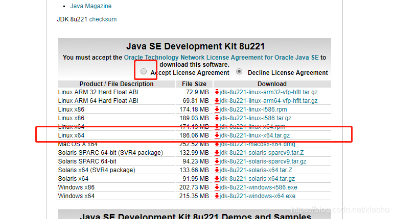
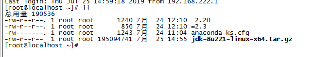
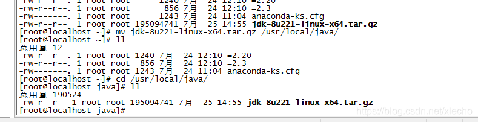
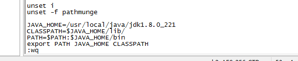
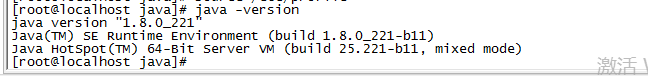

是否安装过

如果安装过 jdk 在可以使用的情况下，没有新要求就不要更换了。如果要跟新版本，那就需要先卸载原有的 jdk

卸载步骤：

查看 linux 上面所有的 jdk 安装包：```rpm -qa | grep jdk (这里会显示所有 jdk 的安装包)

rpm -e --nodeps 上面显示的包名 会卸载对应的包

检查是否还有 jdk java -version

删除残留 jdk 文件

找文件夹 find / -name jdk -d 这条命令 jdk 为变量，你可以改为你想要的找的文件夹名字，它会找到所有有关的文件夹

找文件 find / -name jemalloc.sh 这条命令 jemalloc.sh 是变量，它会找到和改名字一样的文件。 如果熟悉确认查找到的文件是没用文件那就删除 (慎重操作，这一步可以保留),

准备 jdk 安装包

JDK 官网下载地址：http://www.oracle.com/technetwork/java/javase/downloads/jdk8-downloads-2133151.html

选择版本之前可以查看一下自己的 linux 服务器是多少位的系统


进入之后如下界面，先勾选小框框内的同意，然后选中长条形框的版本 (博主选的是框内的，可以不同)



上传你解压

这里你需要准备一个服务器连接工具，博主用的是 SecureCRT8.0(最好用高于 7.5 的，因为能够一键拖入上传文件)

点击 file 打开 Connect SFTP Session,当窗口出现之后，我们将我们下载好的 jdk 拖入即可。当上传完成之后，该窗口就可以关闭了。文件会在我们下方的目录里面



解压之前最好将安装包移动到自己定义的目录中去

创建一个名为 java 的文件夹 mkdir /usr/local/java

使用 mv 命令移动到刚刚创建的文件中



使用 tar 命令解压 tar -xzvf

配置环境变量

打开环境配变量配置如下信息 vi /etc/profile

JAVA_HOME=/usr/local/java/jdk1.8.0_221

CLASSPATH=$JAVA_HOME/lib/

PATH=$PATH:$JAVA_HOME/bin

export PATH JAVA_HOME CLASSPATH

其中第一句是自己解压的文件目录，编辑好了之后点击 shift : 然后 wq 退出



运行命令让配置生效

source /etc/profile

完成安装，检查是否正确

java -version

输入以上命令会出现如下界面。



出现了如上界面就证明 JDK8 已经安装好啦！

————————————————

版权声明：本文为 CSDN 博主「xlecho」的原创文章，遵循 CC 4.0 BY-SA 版权协议，转载请附上原文出处链接及本声明。

原文链接：https://blog.csdn.net/xlecho/article/details/97266591
