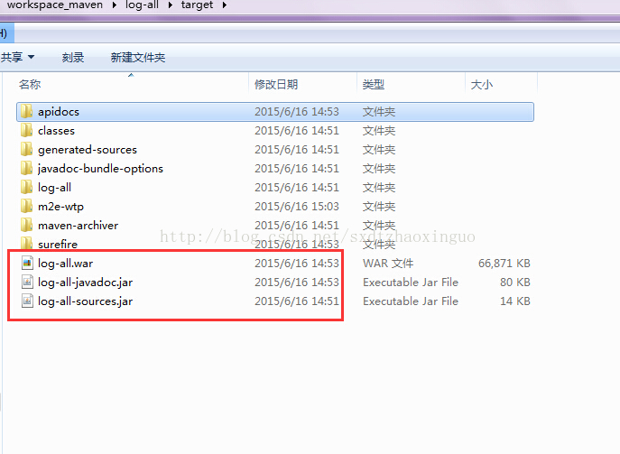

摘要：今天领导说要把项目通过maven生产源码包和文档包并发布到自己的私服上，经过查看mavne官网发现有两个maven插件可以做到这些工作，一个是maven-source-plugin，另一个是maven-javadoc-plugin，现在记录一下！

一：首先在你的项目的pom.xml文件中加入如下配置：

```
<!-- 生成javadoc文档包的插件 -->  
            <plugin>  
                <groupId>org.apache.maven.plugins</groupId>  
                <artifactId>maven-javadoc-plugin</artifactId>  
                <version>2.10.2</version>  
                <configuration>  
                    <aggregate>true</aggregate>  
                </configuration>  
                <executions>  
                    <execution>  
                        <id>attach-javadocs</id>  
                        <goals>  
                            <goal>jar</goal>  
                        </goals>  
                    </execution>  
                </executions>  
            </plugin>  
            <!-- 生成sources源码包的插件 -->  
            <plugin>  
                <artifactId>maven-source-plugin</artifactId>  
                <version>2.4</version>  
                <configuration>  
                    <attach>true</attach>  
                </configuration>  
                <executions>  
                    <execution>  
                        <phase>package</phase>  
                        <goals>  
                            <goal>jar-no-fork</goal>  
                        </goals>  
                    </execution>  
                </executions>  
            </plugin>
```

二：执行maven命令，mvn clean package，执行完成后你就会看到如下图所示：



三：看到上面的图后，说明maven通过sourse，javadoc插件生产对应项目的源码包和文档包成功，如果你还需要发布到自己的私服，那么就再执行一条命令：mvn deploy就可以发布到你自己的私服上了，这样同项目组的人员就可以查看你的项目的源码和文档了！