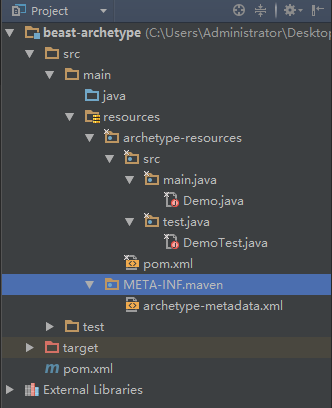
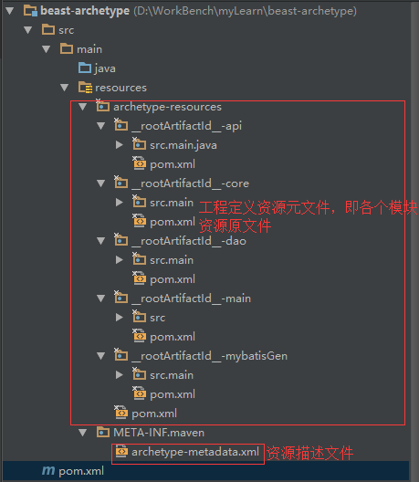
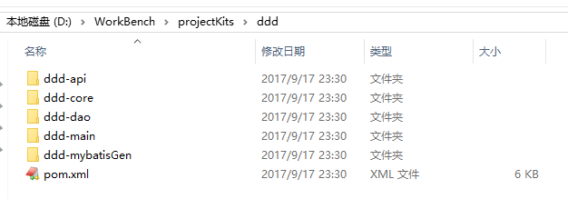

[手写Maven的archetype项目脚手架](https://www.cnblogs.com/hafiz/p/5515388.html)

一、背景

　　maven 是一个很好的代码构建工具，采用“约定优先于配置”的原则进行项目管理，相信很多的 java 开发者应该都了解 maven 并可能在工作当中都是通过 maven 来管理项目的，在创建的项目的时候，我们往往会使用 maven 内置的项目骨架也就是 archetype 来快速生成项目结构。但是在一个团队做开发的过程中，可能仅仅依靠 maven 预先提供的 archetyp 可能是不够的，团队之间协作有自己的定义方式，每个人的结构定义风格也不尽相同，在这样的背景下我们有必要去定义一个统一的代码骨架供团队使用，这样做的好处是当团队需要开始一个新项目的时候，可以利用自定义的 maven 骨架一键生成项目。

　　archetype 是在 maven-archetype-plugin 插件执行 generate 目标的时候进行配置的，我们经常使用到 maven 的内嵌的骨架包括：maven-archetype-webapp、maven-archetype-quickstart。前者用来快速搭建一个 web 工程项目，后者用来快速搭建一个普通的 java 工程项目。

二、手写普通单模块项目的 archetype

单模块项目的 archetype 脚手架项目的结构



上图中的各个文件详解：

- 根目录 beast-archetype 下的 pom.xml 和一般的 maven 项目一样主要定义 archetype 项目的坐标等信息。
- 所有的项目骨架内容都集中在 src/main/resources/archetype-resources 文件夹下。
- archetype-resources 中的 pom.xml 定义了待生成项目的 pom 文件的内容，/src/main/java、/src/test/java 中分别定义了待生成项目中相应目录下的内容
- /src/main/resources/META-INF/maven/archetype-metadata.xml 中定义相关的元数据描述 (其中该文件的位置固定为 resources/META-INF/maven 文件夹下,且名称固定为 archetype-metadata.xml)。

1.beast-archetype/pom.xml 内容如下

```xml
<project xmlns="http://maven.apache.org/POM/4.0.0" xmlns:xsi="http://www.w3.org/2001/XMLSchema-instance"
         xsi:schemaLocation="http://maven.apache.org/POM/4.0.0 http://maven.apache.org/xsd/maven-4.0.0.xsd">
    <modelVersion>4.0.0</modelVersion>

    <groupId>com.thebeastshop</groupId>
    <artifactId>beast-archetype</artifactId>
    <version>1.1</version>
    <packaging>jar</packaging>

    <name>beast-archetype</name>
    <url>http://maven.apache.org</url>

    <properties>
        <project.build.sourceEncoding>UTF-8</project.build.sourceEncoding>
    </properties>

    <dependencies>
        <dependency>
            <groupId>junit</groupId>
            <artifactId>junit</artifactId>
            <version>3.8.1</version>
            <scope>test</scope>
        </dependency>
    </dependencies>
    <build>
        <finalName>beast-archetype</finalName>
    </build>
</project>
```

2.src/main/resources/archetype-resources/pom.xml 内容如下：

```xml
<?xml version="1.0"?>
<project xmlns="http://maven.apache.org/POM/4.0.0"
         xmlns:xsi="http://www.w3.org/2001/XMLSchema-instance"
         xsi:schemaLocation="http://maven.apache.org/POM/4.0.0
            http://maven.apache.org/xsd/maven-4.0.0.xsd">
    <modelVersion>4.0.0</modelVersion>
    <groupId>${groupId}</groupId>
    <artifactId>${artifactId}</artifactId>
    <version>${version}</version>
    <name>${artifactId}</name>
    
    <dependencies>
        <dependency>
            <groupId>junit</groupId>
            <artifactId>junit</artifactId>
            <version>3.8.1</version>
            <scope>test</scope>
        </dependency>
    </dependencies>

    <build>
        <plugins>
             <plugin> 
                 <artifactId>maven-deploy-plugin</artifactId> 
                 <configuration> 
                    <skip>true</skip> 
                 </configuration> 
             </plugin>
        </plugins>
        <pluginManagement>
            <plugins>
                <plugin>
                    <groupId>org.apache.maven.plugins</groupId>
                    <artifactId>maven-archetype-plugin</artifactId>
                    <version>2.2</version>
                    <configuration>
                        <source>1.7</source>
                        <target>1.7</target>
                    </configuration>
                </plugin>
                <plugin>
                    <groupId>org.apache.maven.plugins</groupId>
                    <artifactId>maven-source-plugin</artifactId>
                    <configuration>
                        <encoding>UTF-8</encoding>
                    </configuration>
                </plugin>
            </plugins>
        </pluginManagement>
    </build>
</project>
```

其中：上面 ${}标识的变量都是通过 maven 中的命令行传进来的，如：mvn archetype:generate -DgroupId=com.thebeastshop

3.src/main/resources/META-INF/maven/archetype-metadata.xml 内容如下：

```xml
<?xml version="1.0" encoding="UTF-8"?>
<archetype-descriptor  name="beast-archetype"
        xmlns="http://maven.apache.org/plugins/maven-archetype-plugin/archetype-descriptor/1.0.0"
        xmlns:xsi="http://www.w3.org/2001/XMLSchema-instance"
        xsi:schemaLocation="
            http://maven.apache.org/plugins/maven-archetype-plugin/archetype-descriptor/1.0.0
            http://maven.apache.org/xsd/archetype-descriptor-1.0.0.xsd">

    <requiredProperties>
        <requiredProperty key="package-name" />
    </requiredProperties>

    <fileSets>
        <fileSet filtered="true" packaged="true" encoding="UTF-8">
            <directory>src/main/java</directory>
            <includes>
                <include>**/*.java</include>
            </includes>
        </fileSet>
        <fileSet filtered="true" encoding="UTF-8">
            <directory>src/main/resources</directory>
            <includes>
                <include>**/*.*</include>
            </includes>
        </fileSet>
        <fileSet filtered="true" packaged="true" encoding="UTF-8">
            <directory>src/test/java</directory>
            <includes>
                <include>**/*.java</include>
            </includes>
        </fileSet>
        <fileSet encoding="UTF-8">
            <directory>src/test/resources</directory>
            <includes>
                <include>**/*.*</include>
            </includes>
        </fileSet>
    </fileSets>
</archetype-descriptor>
```

说明：

- packaged="true" 标识 src/main/resources/archetype-resources/src/main/java 中对应的内容是否要放入到 package 中,比如 package 为 com.thebeastshop,那么如果该属性为 true,则对应的 java 文件会放到 com/thebeastshop 文件夹下，也就是包路径下。
- filtered="true" 标识下面提到的 ${}是否要进行替换

4.src/main/resources/archetype-resources/src/main/java/Demo.java 内容如下：

package ${package};

public class Demo{

    public static void main( String[] args ) { 

        System.out.println( "Hello My Archetype!" ); 

    }

 }

5.这样我们就手写好了一个自定义的 maven 的 archetype 骨架项目，我们只需要通过 mvn clean install 命令把该 jar 包安装到本地仓库，然后通过本地仓库中的该 jar 包来生成一个项目看看效果，使用如下命令：

mvn archetype:generate

　　-DgroupId=comthebeastshop

　　-DartifactId=beast-test

　　-Dpackage="com.thebeastshop.test"

　　-DarchetypeGroupId=com.thebeastshop

　　-DarchetypeArtifactId=beast-archetype -DarchetypeVersion=1.1 -X -DarchetypeCatalog=local

三、手写 maven 多 module 的项目骨架 archetype

1.多模块骨架项目的项目结构



这跟单模块项目区别不大，但是有几个概念需要说明：

- “__rootArtifactId__”占位符会被 parent 项目的 artifactId 替换
- ${rootArtifactId}也会被 parent 项目的 artifactId 替换
- src/main/resources/archetype-resources 里必须要有一个顶级 pom 文件（如果是单工程就是工程 pom 文件），同时子文件夹代表了模块定义

2.模板工程定义描述文件：META-INF/maven/archetype-metadata.xml

```xml
<?xml version="1.0" encoding="UTF-8"?>
<archetype-descriptor  name="beast-archetype"
        xmlns="http://maven.apache.org/plugins/maven-archetype-plugin/archetype-descriptor/1.0.0"
        xmlns:xsi="http://www.w3.org/2001/XMLSchema-instance"
        xsi:schemaLocation="
            http://maven.apache.org/plugins/maven-archetype-plugin/archetype-descriptor/1.0.0
            http://maven.apache.org/xsd/archetype-descriptor-1.0.0.xsd">

    <requiredProperties>
        <requiredProperty key="groupId">
            <defaultValue>com.thebeastshop</defaultValue>
        </requiredProperty>
        <requiredProperty key="artifactId">
            <defaultValue>test</defaultValue>
        </requiredProperty>
        <requiredProperty key="package">
            <defaultValue>com.thebeastshop.test</defaultValue>
        </requiredProperty>
    </requiredProperties>

    <modules>
        <module id="${rootArtifactId}-api" name="${rootArtifactId}-api" dir="__rootArtifactId__-api">
            <fileSets>
                <fileSet filtered="true" encoding="UTF-8" packaged="true">
                    <directory>src/main/java</directory>
                    <includes>
                        <include>**/*.*</include>
                    </includes>
                </fileSet>
                <fileSet filtered="true" encoding="UTF-8" packaged="true">
                    <directory>src/test/java</directory>
                    <includes>
                        <include>**/*.*</include>
                    </includes>
                </fileSet>
                <fileSet encoding="UTF-8">
                    <directory>src/main/resources</directory>
                    <includes>
                        <include>**/*.*</include>
                    </includes>
                </fileSet>
                <fileSet encoding="UTF-8">
                    <directory>src/test/resources</directory>
                    <includes>
                        <include>**/*.*</include>
                    </includes>
                </fileSet>
            </fileSets>
        </module>
        <module id="${rootArtifactId}-core" name="${rootArtifactId}-core" dir="__rootArtifactId__-core">
            <fileSets>
                <fileSet filtered="true" encoding="UTF-8" packaged="true">
                    <directory>src/main/java</directory>
                    <includes>
                        <include>**/*.*</include>
                    </includes>
                </fileSet>
                <fileSet filtered="true" encoding="UTF-8" packaged="true">
                    <directory>src/test/java</directory>
                    <includes>
                        <include>**/*.*</include>
                    </includes>
                </fileSet>
                <fileSet filtered="true" encoding="UTF-8">
                    <directory>src/main/resources</directory>
                    <includes>
                        <include>**/*.*</include>
                    </includes>
                </fileSet>
                <fileSet encoding="UTF-8">
                    <directory>src/test/resources</directory>
                    <includes>
                        <include>**/*.*</include>
                    </includes>
                </fileSet>
            </fileSets>
        </module>
        <module id="${rootArtifactId}-dao" name="${rootArtifactId}-dao" dir="__rootArtifactId__-dao">
            <fileSets>
                <fileSet filtered="true" encoding="UTF-8" packaged="true">
                    <directory>src/main/java</directory>
                    <includes>
                        <include>**/*.*</include>
                    </includes>
                </fileSet>
                <fileSet filtered="true" encoding="UTF-8" packaged="true">
                    <directory>src/test/java</directory>
                    <includes>
                        <include>**/*.*</include>
                    </includes>
                </fileSet>
                <fileSet filtered="true" encoding="UTF-8">
                    <directory>src/main/resources</directory>
                    <includes>
                        <include>**/*.*</include>
                        <include>mapper</include>
                    </includes>
                </fileSet>
                <fileSet encoding="UTF-8">
                    <directory>src/test/resources</directory>
                    <includes>
                        <include>**/*.*</include>
                    </includes>
                </fileSet>
            </fileSets>
        </module>
        <module id="${rootArtifactId}-main" name="${rootArtifactId}-main" dir="__rootArtifactId__-main">
            <fileSets>
                <fileSet filtered="true" encoding="UTF-8" packaged="true">
                    <directory>src/main/java</directory>
                    <includes>
                        <include>**/*.*</include>
                    </includes>
                </fileSet>
                <fileSet filtered="true" encoding="UTF-8" packaged="true">
                    <directory>src/test/java</directory>
                    <includes>
                        <include>**/*.*</include>
                    </includes>
                </fileSet>
                <fileSet filtered="true" encoding="UTF-8">
                    <directory>src/main/resources</directory>
                    <includes>
                        <include>**/*.*</include>
                    </includes>
                </fileSet>
                <fileSet encoding="UTF-8">
                    <directory>src/test/resources</directory>
                    <includes>
                        <include>**/*.*</include>
                    </includes>
                </fileSet>
                <fileSet encoding="UTF-8">
                    <directory>src/main/assembly</directory>
                    <includes>
                        <include>**/*.*</include>
                    </includes>
                </fileSet>
                <fileSet encoding="UTF-8">
                    <directory>src/main/bin</directory>
                    <includes>
                        <include>**/*.*</include>
                    </includes>
                </fileSet>
            </fileSets>
        </module>
        <module id="${rootArtifactId}-mybatisGen" name="${rootArtifactId}-mybatisGen" dir="__rootArtifactId__-mybatisGen">
            <fileSets>
                <fileSet filtered="true" encoding="UTF-8" packaged="true">
                    <directory>src/main/java</directory>
                    <includes>
                        <include>**/*.*</include>
                    </includes>
                </fileSet>
                <fileSet filtered="true" encoding="UTF-8" packaged="true">
                    <directory>src/test/java</directory>
                    <includes>
                        <include>**/*.*</include>
                    </includes>
                </fileSet>
                <fileSet encoding="UTF-8">
                    <directory>src/main/resources</directory>
                    <includes>
                        <include>**/*.*</include>
                    </includes>
                </fileSet>
                <fileSet encoding="UTF-8">
                    <directory>src/test/resources</directory>
                    <includes>
                        <include>**/*.*</include>
                    </includes>
                </fileSet>
            </fileSets>
        </module>
    </modules>
</archetype-descriptor>
```

- 属性变量定义
- <requiredProperties> 
     <requiredProperty key="groupId"> 
        <defaultValue>com.thebeastshop</defaultValue> 
    </requiredProperty> 
    <requiredProperty key="artifactId"> 
	    <defaultValue>test</defaultValue>
	</requiredProperty> 
	<requiredProperty key="package"> 
		<defaultValue>com.thebeastshop.test</defaultValue> 
	<requiredProperty> 
   </requiredProperties>

这些属性可以在资源元文件里的任意一个文件里通过 ${var}来引用，所以的元文件最终都可以选择通过 velocity 引擎来执行替换后生成。

默认的属性有：groupId，artifactId，packeage，version 等

- 项目子模块定义

```xml
<modules>
    <module id="${rootArtifactId}-api" name="${rootArtifactId}-api" dir="__rootArtifactId__-api">
        …
    </module>
    <module id="${rootArtifactId}-core" name="${rootArtifactId}-core" dir="__rootArtifactId__-core">
        …
    </module>
    <module id="${rootArtifactId}-dao" name="${rootArtifactId}-dao" dir="__rootArtifactId__-dao">
        …
    </module>
    <module id="${rootArtifactId}-main" name="${rootArtifactId}-main" dir="__rootArtifactId__-main">
        …
    </module>
    <module id="${rootArtifactId}-mybatisGen" name="${rootArtifactId}-mybatisGen" dir="__rootArtifactId__-mybatisGen">
        …
    </module>
</modules>

```

module 有三个属性，解释如下：

id     ：定义子模块工程的 artifactId.

dir    ：子模块工程源文件在 archetype-resources 里对应的 directory.

name   ：子模块的名字.

3.子模块 pom.xml 定义如下 (以 core 模块为例)：

```
<?xml version="1.0"?>
<project xmlns="http://maven.apache.org/POM/4.0.0"
         xmlns:xsi="http://www.w3.org/2001/XMLSchema-instance"
         xsi:schemaLocation="http://maven.apache.org/POM/4.0.0
            http://maven.apache.org/xsd/maven-4.0.0.xsd">
    <modelVersion>4.0.0</modelVersion>
    <parent>
        <groupId>com.thebeastshop</groupId>
        <artifactId>${rootArtifactId}</artifactId>
        <version>${version}</version>
    </parent>

    <artifactId>${artifactId}</artifactId>
    <name>${artifactId}</name>
    
    <dependencies>
        <dependency>
            <groupId>com.thebeastshop</groupId>
            <artifactId>${rootArtifactId}-api</artifactId>
            <version>${api.version}</version>
        </dependency>
        <dependency>
            <groupId>com.thebeastshop</groupId>
            <artifactId>${rootArtifactId}-dao</artifactId>
            <version>${project.parent.version}</version>
        </dependency>
    </dependencies>
    
    <build>
        <plugins>
             <plugin> 
                 <artifactId>maven-deploy-plugin</artifactId> 
                 <configuration> 
                    <skip>true</skip> 
                 </configuration> 
             </plugin>
        </plugins>
    </build>
</project>

```

其中 ${rootArtifactId}就代表父项目的 artifactId.

4.我们和单模块脚手架工程一样，通过 mvn clean install 命令把该脚手架项目安装到本地 maven 仓库，然后就可以使用该项目来快速生成新项目结构了，生成命令如下：

mvn archetype:generate

　　-DgroupId=com.thebeastshop

　　-DartifactId=ddd

　　-Dversion=1.0.0-SNAPSHOT

　　-DarchetypeGroupId=com.thebeastshop

　　-DarchetypeArtifactId=beast-archetype

　　-DarchetypeVersion=1.3-SNAPSHOT -X -DarchetypeCatalog=local

我们就会看到生成好的项目结构如下：



多模块项目脚手架源码：[https://github.com/hafizzhang/beast-archetype](https://github.com/hafizzhang/beast-archetype)

四、总结

　　在工作中，我们通常要有“偷懒”意识，通过摸索来开发出类似项目脚手架一样的工具来提升自己工作的效率。不能整天都是浑浑噩噩的过去，而且表面上看上去很难的东西实际上并不见得一定就如想象中的难。程序猿还是要有所追求，哈哈~
