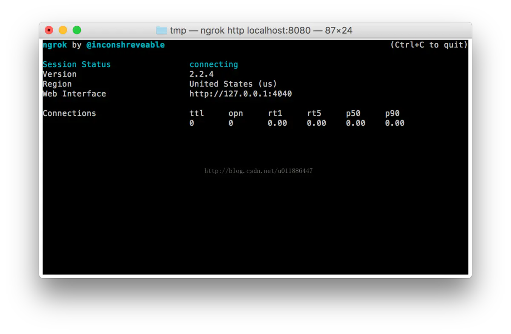
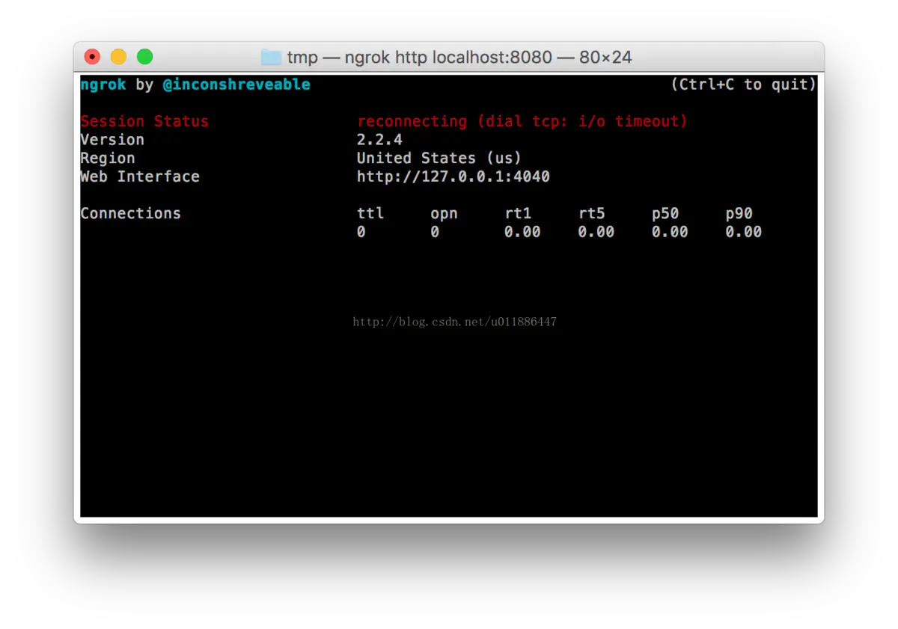
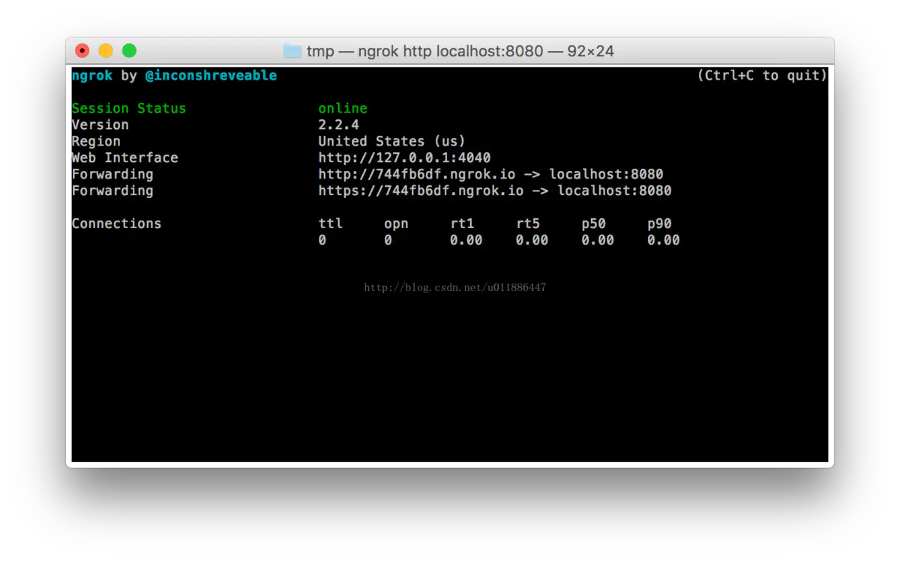

下载 MAC 版的 ngrok：https://ngrok.com/download

解压到指定目录：

$ unzip -n ngrok-stable-darwin-amd64.zip -d /tmp

进入到解压后的 ngrok 所在路径：

$ cd /tmp

开启服务：

$ ./ngrok http localhost:8080

输入命令后会先出现图 1，图 2 的情况，稍等片刻，等 Session Status 显示为 online 状态时即可使用外网访问。即：以前使用 http://localhost:8080/testWeb 访问，现在便可使用 http://744fb6df.ngrok.io/testWeb 进行访问，http://744fb6df.ngrok.io 就是本地服务映射到外网的地址。其中 744fb6df 不是固定的，在每次开始 ngrok 服务的时候都会变更。

转自：http://blog.csdn.net/u011886447/article/details/73268407

作者：Melody_YM

链接：https://www.jianshu.com/p/5c9d77d7a8f9

来源：简书

著作权归作者所有。商业转载请联系作者获得授权，非商业转载请注明出处。
