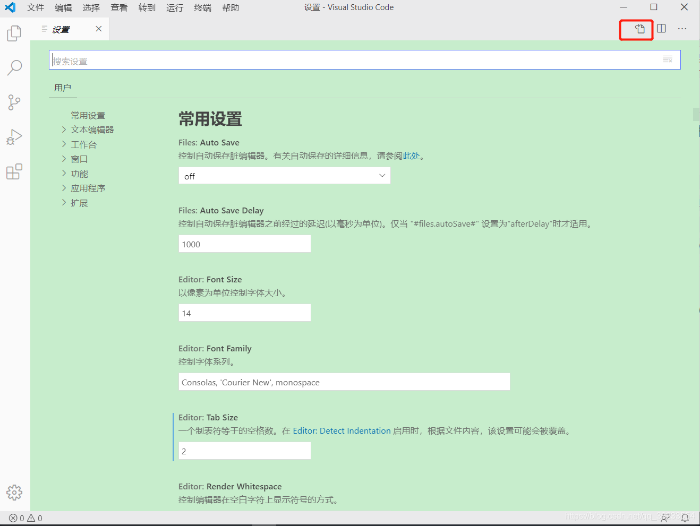
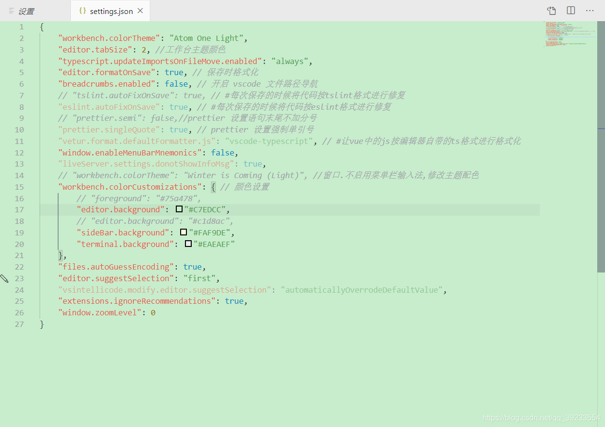

下载主题

打开 VS code 选择’文件’‘→’首选项’→’颜色主题’：在弹出来的输入框输入 Atom One Light Theme，后下载并安装该主题，安装后重启 vscode。

设置护眼色

(在这里说下，一般情况来说安装完主题后就会自动使用下载的主题，如果没有自动使用，那就手动选择一下就好了。)

打开 VS code 选择’文件’→’首选项’→’设置’

之后会进入如下页面，选中红框的图标，点击进入。



点击后会进入 settings.json 页面如下：(注：我这里是设置后的,我的设置也是仿照别人的写着来的，大家可以自己更改自己喜欢的属性。具体跳转)



复制下面的内容，替换原文件内容后重启 vscode。

```json
{
    "workbench.colorTheme": "Atom One Light",
    "editor.tabSize": 2, //工作台主题颜色
    "typescript.updateImportsOnFileMove.enabled": "always",
    "editor.formatOnSave": true, // 保存时格式化
    "breadcrumbs.enabled": false, // 开启 vscode 文件路径导航
    // "tslint.autoFixOnSave": true, // #每次保存的时候将代码按tslint格式进行修复
    "eslint.autoFixOnSave": true, // #每次保存的时候将代码按eslint格式进行修复
    // "prettier.semi": false,//prettier 设置语句末尾不加分号
    "prettier.singleQuote": true, // prettier 设置强制单引号
    "vetur.format.defaultFormatter.js": "vscode-typescript", // #让vue中的js按编辑器自带的ts格式进行格式化 
    "window.enableMenuBarMnemonics": false,
    "liveServer.settings.donotShowInfoMsg": true,
    // "workbench.colorTheme": "Winter is Coming (Light)", //窗口.不启用菜单栏输入法,修改主题配色
    "workbench.colorCustomizations": { // 颜色设置
        // "foreground": "#75a478",
        "editor.background": "#C7EDCC",
        // "editor.background": "#c1d8ac",
        "sideBar.background": "#FAF9DE",
        "terminal.background": "#EAEAEF"
    },
    "files.autoGuessEncoding": true,
    "editor.suggestSelection": "first",
    "vsintellicode.modify.editor.suggestSelection": "automaticallyOverrodeDefaultValue",
    "extensions.ignoreRecommendations": true,
    "window.zoomLevel": 0
}
```
