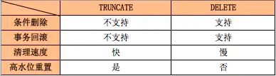
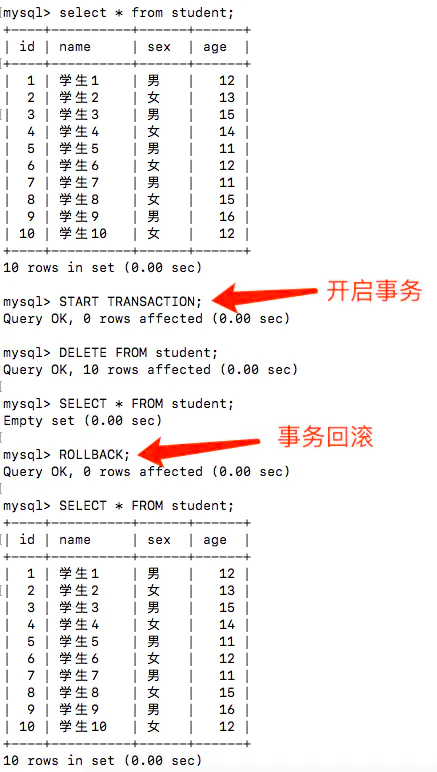
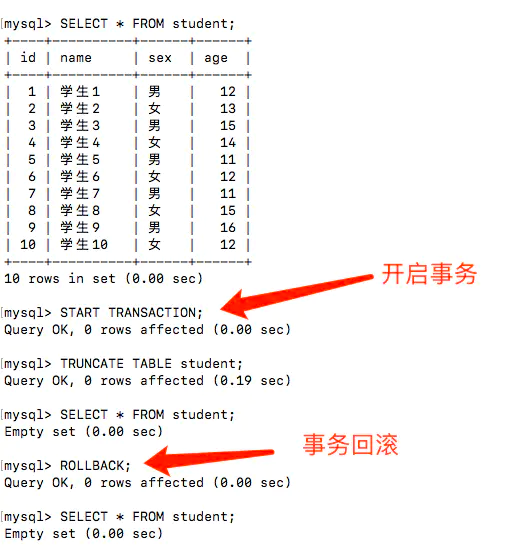

MYSQL中TRUNCATE和DELETE都能够清理表中的数据，但是他们有什么区别呢？我们从下面的几点来分析：

image.png

1. 条件删除

这个比较好理解，因为DELETE是可以带WHERE的，所以支持条件删除；而TRUNCATE只能删除整个表。

# delete - 条件删除

DELETE FROM student WHERE id = 1;

# delete - 删除整个表的数据

DELETE FROM student;

# truncate - 删除整个表的数据

TRUNCATE TABLE student;

2. 事务回滚

由于DELETE是数据操作语言（DML - Data Manipulation Language），操作时原数据会被放到 rollback segment中，可以被回滚；而TRUNCATE是数据定义语言（DDL - Data Definition Language)，操作时不会进行存储，不能进行回滚。

DELETE回滚实验

可以看到DELETE是可以回滚成功的。

TRUNCATE回滚实验

可以看到TRUNCATE是不能回滚成功的。

3. 清理速度

在数据量比较小的情况下，DELETE和TRUNCATE的清理速度差别不是很大。但是数据量很大的时候就能看出区别。由于第二项中说的，TRUNCATE不需要支持回滚，所以使用的系统和事务日志资源少。DELETE 语句每次删除一行，并在事务日志中为所删除的每行记录一项，固然会慢，但是相对来说也较安全。

4. 高水位重置

随着不断地进行表记录的DML操作，会不断提高表的高水位线（HWM），DELETE操作之后虽然表的数据删除了，但是并没有降低表的高水位，随着DML操作数据库容量也只会上升，不会下降。所以如果使用DELETE，就算将表中的数据减少了很多，在查询时还是很和DELETE操作前速度一样。

而TRUNCATE操作会重置高水位线，数据库容量也会被重置，之后再进行DML操作速度也会有提升。

作者：唐T唐X

链接：https://www.jianshu.com/p/ddc5b65e63af

来源：简书

著作权归作者所有。商业转载请联系作者获得授权，非商业转载请注明出处。