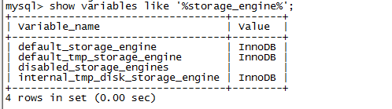

如何查看 MySQL 的当前存储引擎？

一般情况下，mysql 会默认提供多种存储引擎,你可以通过下面的查看:

看你的 mysql 现在已提供什么存储引擎:

mysql> show engines;

看你的 mysql 当前默认的存储引擎:

mysql> show variables like '%storage_engine%';

mysql5.7 的默认存储引擎是 InnoDB

你要看某个表用了什么引擎 (在显示结果里参数 engine 后面的就表示该表当前用的存储引擎):

mysql> show create table 表名;

来源： [https://www.cnblogs.com/zhming26/p/6322353.html](https://www.cnblogs.com/zhming26/p/6322353.html)
