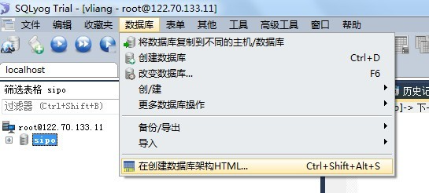
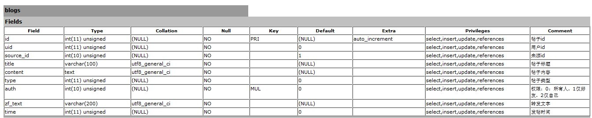
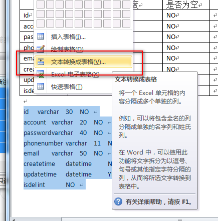
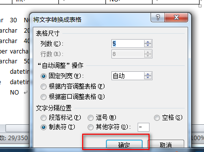
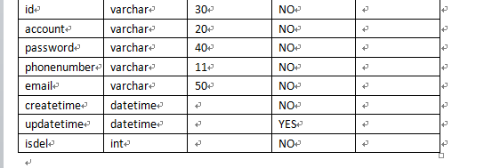

方法一：

1.使用一个 [MySQL](http://lib.csdn.net/base/mysql) 管理工具：SQLyog，点击菜单栏“[数据库](http://lib.csdn.net/base/mysql)”下拉的最后一项：

导出的格式如下：

2.要想转成 Excel 格式的只需手动将该表复制到 Excel 中去。

方法二：

1.以下用的是 Navicat Premium，可以换成任意图形化客户端

SELECT

  COLUMN_NAME 列名,

  COLUMN_TYPE 数据类型,

    DATA_TYPE 字段类型,

  CHARACTER_MAXIMUM_LENGTH 长度,

  IS_NULLABLE 是否为空,

  COLUMN_DEFAULT 默认值,

  COLUMN_COMMENT 备注 

FROM

 INFORMATION_SCHEMA.COLUMNS

where

-- developerclub 为数据库名称，到时候只需要修改成你要导出表结构的数据库即可

table_schema ='developerclub'

AND

-- article 为表名，到时候换成你要导出的表的名称

-- 如果不写的话，默认会查询出所有表中的数据，这样可能就分不清到底哪些字段是哪张表中的了，所以还是建议写上要导出的名名称

table_name  = 'article'

2.查询结果图

3.然后全选复制结果到 Excel 表中即可

转为 Word 表格

选中内容，插入表格，将文本转为表格

