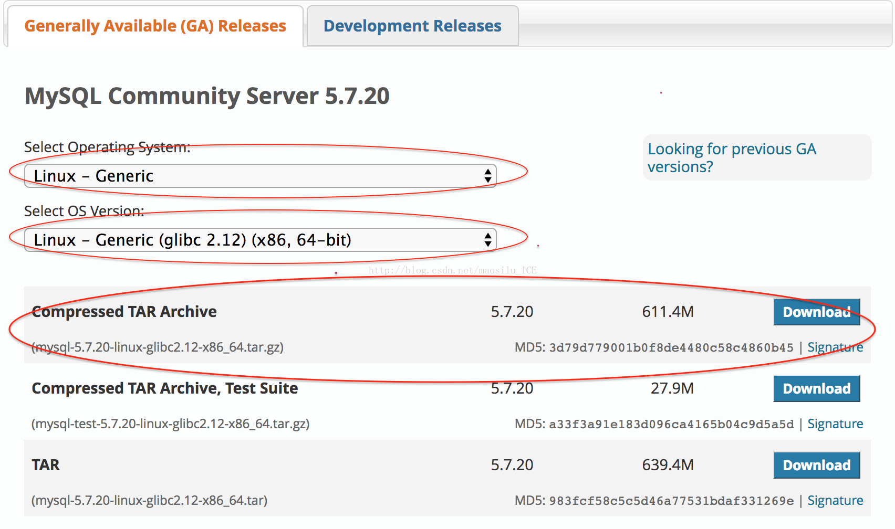
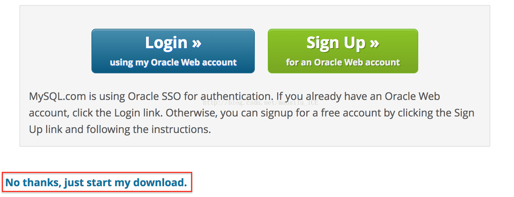

最近在我的阿里云服务器上配置目前最新版的 mysql5.7.20，期间出现各种奇葩问题，针对自己的各种问题也是网上各种扒资料，各个击破，最后终于大功告成。

趁热打铁，以下将自己的安装登录过程以及遇到的问题尽力按照流程详细还原！

1.准备工作（由于个人有强迫症并且力求完美，所以文件的存放位置，也尽量按照 linux 标准，我是 linux 小小白～）

（说明：此次下载源码存放位置都在：/usr/local/src 解压后的代码存放在：/usr/local 下的 mysql 中，当然需要在/usr/local 中使用 mkdir mysql 创建 mysql 文件夹）

mysql5.7.20 的下载：

https://dev.mysql.com/downloads/mysql/

如图选择 linux 的通用版本，我的是 64 位系统（注意：我这个下载的不是源码版本，而是二进制版本，不需要编译，之前想要使用源码版本，由于编译时间久且总是出现我解决不了的问题，故而没有深究直接放弃了），所以我选择 64 为版本，下载第一个，点击第一个后面的“download”跳转到页面 https://dev.mysql.com/downloads/file/?id=473559 看到：

这里你可以选择登录也可以选择不登录。点击下面的红框可以直接下载。因为我这里是远程登录阿里云服务器，所以右键 ->复制链，然后到我的阿里云服务器中使用 wget 下载，将 mysql5.7 的二进制源码下载到/usr/local/src 中。以下是下载步骤：

(1) 进入/usr/local/src 文件夹 cd /usr/local/src

(2) 下载 mysql： wget https://dev.mysql.com/get/Downloads/MySQL-5.7/mysql-5.7.20-linux-glibc2.12-x86_64.tar.gz

(3) 解压下载的问价：

 tar -zxvf mysql-5.7.20-linux-glibc2.12-x86_64.tar.gz

(4) 将加压后的文件内容移动到 /usr/local/mysql 中，没有此文件夹就使用 mkdir ／usr/local/mysql 创建

mv mysql-5.7.20-linux-glibc2.12-x86_64/* mysql

(5) 创建用户和用户组并赋予权限（这一步我也不是特别明白为什么这么做，还需要多多学习 linux，多多去研究，不放过任何知识）

[root@dbserver ~]# groupadd mysql  #创建用户组mysql

[root@dbserver ~]# useradd -r -g mysql mysql //useradd -r 参数表示 mysql 用户是系统用户，不可用于登录系统，创建用户 mysql 并将其添加到用户组 mysql 中

[root@dbserver local]# chown -R mysql mysql/

[root@dbserver local]# chgrp -R mysql mysql/

2.开始安装并配置 my.cnf

（6）安装和初始化数据库

⚠️初始化数据库：在 5.7.6 之前初始化的方法是：bin/mysql_install_db

5.7.6 之后的版本初始化数据库不再使用 mysql_install_db，而是使用： bin/mysqld --initialize

mysql5.7 初始化数据库后会默认生成一个初始的登录密码，第一次登录要使用初始密码，初始密码的获取下面会讲到

安装和初始化数据库有两种方式，建议使用 a，个人使用的是 b

a.初始化数据库后配置

<1>初始化数据库：

[root@dbserver mysql]# bin/mysqld --initialize --user=mysql --basedir=/usr/local/mysql --datadir=/usr/local/mysql/data  --lc_messages_dir=/usr/local/mysql/share --lc_messages=en_US

<2>获取初始登录密码：

执行上一步操作后会在命令行输出 root@localhost: gFamcspKm2+u localhost: 后面的这一串便是你首次登陆 mysql 需要的初始密码

<3>配置 my.cnf

接下来进入/usr/local/mysql/support-files/目录下

查看是否存在 my-default.cnf 文件，如果存在直接 copy 到/etc/my.cnf 文件中

    [root@dbserver mysql]# cp -a ./support-files/my-default.cnf /etc/my.cnf

1

一键获取完整项目代码

如果不存在 my-default.cnf 文件,则在/etc/目录下创建 my.cnf,并写入以下内容，例如我的是这样的：

[mysqld]

character_set_server=utf8

init_connect='SET NAMES utf8'

basedir=/usr/local/mysql

datadir=/usr/local/mysql/data

socket=/tmp/mysql.sock

log-error=/var/log/mysqld.log

pid-file=/var/run/mysqld/mysqld.pid

一键获取完整项目代码

b.配置后初始化数据库

<1>同 a 中的<3>

<2>同 a 中的<1>

<3>获取初始登录密码

这个的初始登录密码将不会在执行第二步之后被输出到命令行中，而是会被存放在错误日志中。错误日志路径就是你在 my.cnf 中配置的 log-error=/var/log/mysqld.log

执行：

cat  /var/log/mysqld.log

能够看到一行信息，例如我的是：

2017-11-29T01:55:23.192210Z 1 [Note] A temporary password is generated for root@localhost: Q5Sck93kdK/*

localhost: 后面的一串就是你 mysql 登录的初始密码。

⚠️如果你的初始密码丢失，可以备份 data 数据：mv /usr/local/mysql/data data.bak 或者直接删除 data 数据：rm -rf /usr/local/mysql/data 然后初始化数据库：

[root@dbserver mysql]# bin/mysqld --initialize --user=mysql 重新生成初始密码然后查看并记住。此处还有其他的方法，大家可以尝试一下，参考：http://blog.csdn.net/ljbmxsm/article/details/50612777

3.启动服务

[root@dbserver mysql]# cd bin/

[root@dbserver bin]# ./mysqld_safe --user=mysql &

4.设置开机启动

进入 /usr/local/mysql 文件夹

[root@dbserver support-files]# cp mysql.server /etc/init.d/mysql  //设置开机启动

5.使用 service mysqld 命令启动/停止服务

例如我的 mysql：启动/停止/暂停：

service mysqld start/stop/restart

执行命令出现 OK 时说明成功，如果有其他提示，可以在看看出现了什么问题

6.登录 mysql

[root@dbserver bin]# ./mysql -u root -p //密码是第 2 步产生的初始密码

7.设置密码

mysql>  set password=password("new password");

Query OK, 0 rows affected, 1 warning (0.00 sec)

mysql> flush privileges;

8.退出当前的 mysql 服务，并重启，再用新的密码登录 mysql，成功！

————————————————

版权声明：本文为 CSDN 博主「茅丝录」的原创文章，遵循 CC 4.0 BY-SA 版权协议，转载请附上原文出处链接及本声明。

原文链接：https://blog.csdn.net/maosilu_ICE/article/details/78662847
