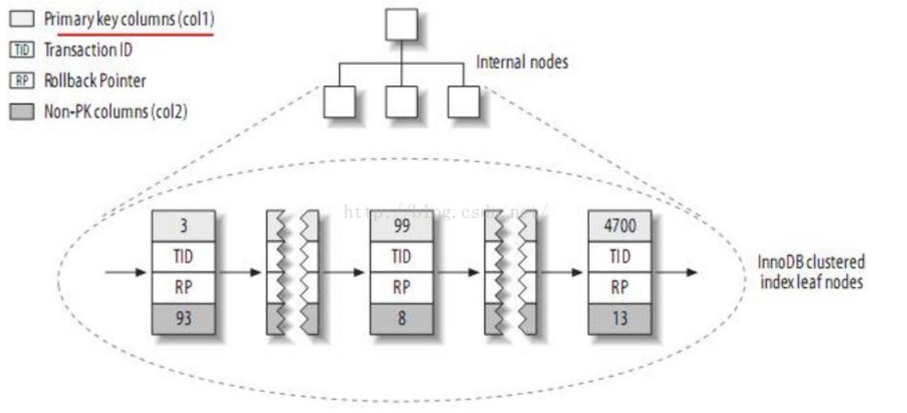
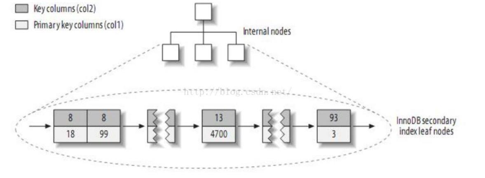
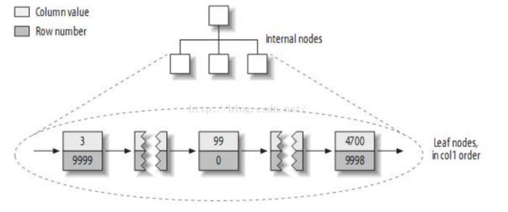
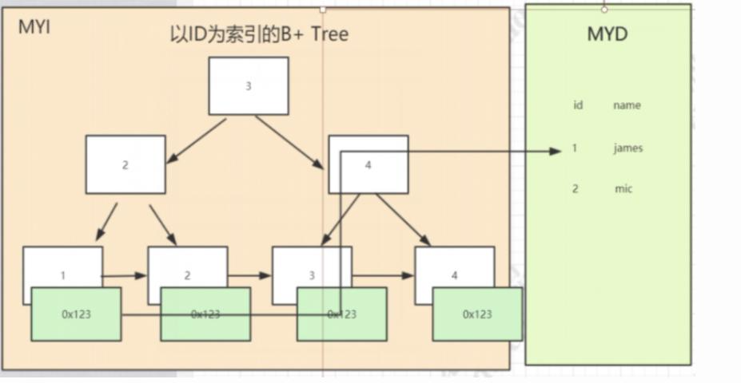
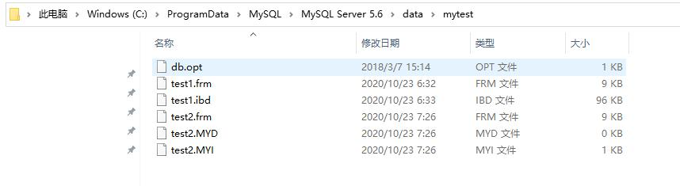
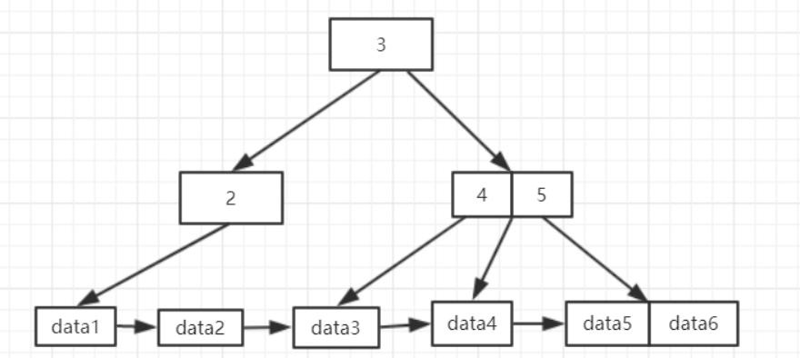
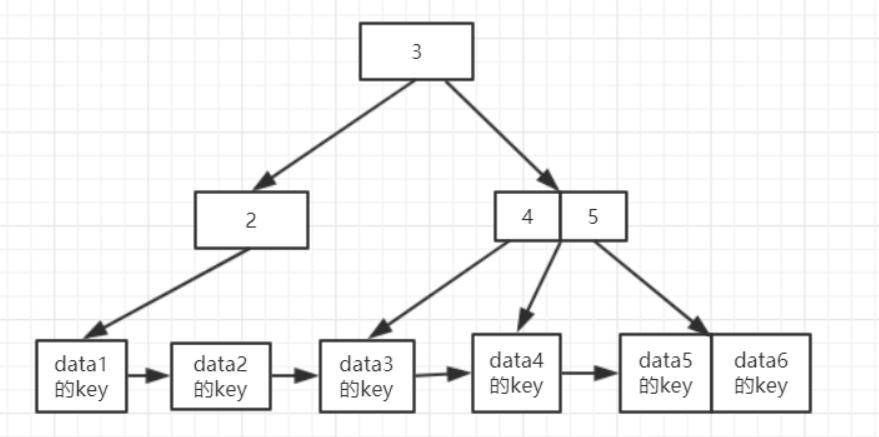

目录

[1.聚簇索引和非聚簇索引的概念](https://www.freesion.com/article/78641406633/#1.%E8%81%9A%E7%B0%87%E7%B4%A2%E5%BC%95%E5%92%8C%E9%9D%9E%E8%81%9A%E7%B0%87%E7%B4%A2%E5%BC%95%E7%9A%84%E6%A6%82%E5%BF%B5)

[2.两者详细介绍](https://www.freesion.com/article/78641406633/#2.%E4%B8%A4%E8%80%85%E8%AF%A6%E7%BB%86%E4%BB%8B%E7%BB%8D)

[3. 两者的区别](https://www.freesion.com/article/78641406633/#3.%20%E4%B8%A4%E8%80%85%E7%9A%84%E5%8C%BA%E5%88%AB)

[3.1 数据存储方式](https://www.freesion.com/article/78641406633/#3.1%20%E6%95%B0%E6%8D%AE%E5%AD%98%E5%82%A8%E6%96%B9%E5%BC%8F)

[3.2 二级索引查询](https://www.freesion.com/article/78641406633/#3.2%C2%A0%E4%BA%8C%E7%BA%A7%E7%B4%A2%E5%BC%95%E6%9F%A5%E8%AF%A2)

---

1.聚簇索引和非聚簇索引的概念

 数据库表的索引从数据存储方式上可以分为聚簇索引和非聚簇索引两种。“聚簇”的意思是数据行被按照一定顺序一个个紧密地排列在一起存储。我们熟悉的InnoDB和MyISAM两大引擎，InnoDB的默认数据结构是聚簇索引，而MyISAM是非聚簇索引。

聚簇索引（Clustered Index）并不是一种单独的索引类型，而是一种数据存储方式。当表有了聚簇索引的时候，表的数据行都存放在索引树的叶子页中。无法把数据行放到两个不同的地方，所以一张表只允许有一个聚簇索引。InnoDB的聚簇索引实际上是将索引和数据保存中同一个B-Tree中。InnoDB通过主键聚集数据，如果没有定义主键，InnoDB会选择一个唯一的的非空索引代替。如果没有这样的索引，InnoDB会隐式定义一个主键来作为聚簇索引。

非聚簇索引（NoClustered Index），又叫二级索引。二级索引的叶子节点中保存的不是指向行的物理指针，而是行的主键值。当通过二级索引查找行，存储引擎需要在二级索引中找到相应的叶子节点，获得行的主键值，然后使用主键去聚簇索引中查找数据行，这需要两次B-Tree查找。

2.两者详细介绍

因为聚簇和非聚簇索引本质上是数据存储方式，需要依赖于载体，即以InnoDB引起来讲解聚簇索引，以MyISAM来讲解非聚簇索引。下述讲解的图都引用自《高性能MySQL》。

对于InnoDB引擎来说，是按照聚簇索引的形式存储数据：

它的每个聚簇索引的叶子节点都包含主键值、事务ID、回滚指针(用于事务和MVCC)以及余下的列。从物理文件也可以看出 InnoDB的数据文件只有数据结构文件.frm和数据文件.ibd 其中.ibd中存放的是数据和索引信息 是存放在一起的。

InnoDB的二级索引和主键索引也有很大的不同，二级索引存放的是主键值而不是行指针，减少了移动数据或者分裂时维护二级索引的开销，因为不需要更新索引的行指针。

对于MyISAM引擎来说，是按照非聚簇索引的形式存储数据：

原始数据：

 存储方式：

按照列值和行号来组织索引的，叶子节点中保存的实际上是指向存放数据块的指针。从物理文件中也可以看出MyISAM的索引文件.MYI和数据文件.MYD是分开存储的 是相对独立的。

举例：执行流程：select * from user where id =1

1、查看该user表的myi索引文件中有没有以id为索引的索引树

2、在id索引树上通过id值找到相应节点，从而得到节点的数据（叶子节点存的是索引值和数据地址，数据地址指向当前表myd数据文件具体的哪一行）

3、根据数据地址去myd文件里找到对应的数据返回。

3. 两者的区别

3.1 数据存储方式

最直观的区别是反映在数据存储方式上，在MySQL数据库中InnoDB（聚簇）和MyISAM（非聚簇）数据存储文件格式如下：

1. 存储引擎是InnoDB, 在data目录下会看到2类文件：.frm、.ibd
2. （1）*.frm--表结构的文件。
3. （2）*.ibd--表数据文件

4. 存储引擎是MyISAM, 在data目录下会看到3类文件：.frm、.myi、.myd
5. （1）*.frm--表定义，是描述表结构的文件。
6. （2）*.MYD--"D"数据信息文件，是表的数据文件。
7. （3）*.MYI--"I"索引信息文件，是表数据文件中任何索引的数据树

示意图，test1的存储引擎为InnoDB，test2的存储引擎为MyISAM：

聚簇索引和非聚簇索引的存储方式区别：

1. 在MyISAM引擎索引和数据是分开存储的，而InnoDB是索引和数据是一起以idb文件的形式进行存储的。
2. 在访问速度上，聚簇索引比非聚簇索引快。非聚簇索引需要先查询一遍索引文件，得到索引，跟据索引获取数据。而聚簇索引的索引树的叶子节点的直接指向要查找的数据行。

3.2 二级索引查询

对于采用聚簇索引的InnoDB引擎的主键索引B+Tree和MyISAM的主键索引树以及MyISAM的二级索引B+Tree都是采用这样的结构。

 但是InnoDB的二级索引B+Tree却是这样的：

可以得出：

　　在使用二级索引进行查询的时候，InnoDB首先通过二级索引B+Tree得到数据行的主键索引，然后再通过主键索引树查询数据。所以在二级索引，InnoDB的性能消耗比较大。

　　但是，这种情况在InnoDB中有一定的优化，不是认为控制的，而是引擎实现的，通过二级索引查询多了，InnoDB会生成自适应的哈希索引。

引用高性能MySQL的图能更加清晰的看到其差异：

从图中可以看出 InnoDB二级索引的叶子节点存放的是KEY字段+主键值，因此首先通过二级索引查找到的是主键值，再根据主键值在主键索引中查找到相应的数据文件。而MyISAM的二级索引存放的还是列值和行号的组合 叶子节点中保存的是指向物理数据的指针，因此它的主建索引和二级索引的结构并没有任何区别，只是说主键索引的索引值是唯一且非空的，而MyISAM引擎可以不设置主键。InnoDB引擎是必须设置主键的，需要依赖主键生成聚簇索引。