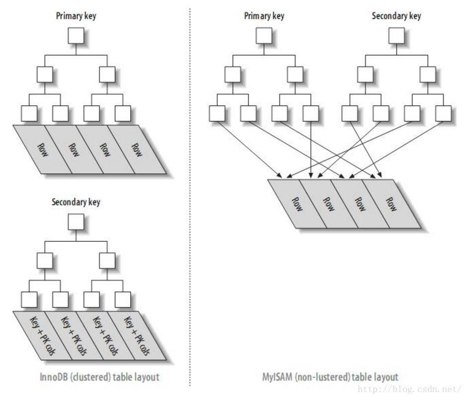

目录

[1.聚簇索引和非聚簇索引的概念](https://www.freesion.com/article/78641406633/#1.%E8%81%9A%E7%B0%87%E7%B4%A2%E5%BC%95%E5%92%8C%E9%9D%9E%E8%81%9A%E7%B0%87%E7%B4%A2%E5%BC%95%E7%9A%84%E6%A6%82%E5%BF%B5)

[2.两者详细介绍](https://www.freesion.com/article/78641406633/#2.%E4%B8%A4%E8%80%85%E8%AF%A6%E7%BB%86%E4%BB%8B%E7%BB%8D)

[3. 两者的区别](https://www.freesion.com/article/78641406633/#3.%20%E4%B8%A4%E8%80%85%E7%9A%84%E5%8C%BA%E5%88%AB)

[3.1 数据存储方式](https://www.freesion.com/article/78641406633/#3.1%20%E6%95%B0%E6%8D%AE%E5%AD%98%E5%82%A8%E6%96%B9%E5%BC%8F)

[3.2 二级索引查询](https://www.freesion.com/article/78641406633/#3.2%C2%A0%E4%BA%8C%E7%BA%A7%E7%B4%A2%E5%BC%95%E6%9F%A5%E8%AF%A2)

---

1.聚簇索引和非聚簇索引的概念

 数据库表的索引从数据存储方式上可以分为聚簇索引和非聚簇索引两种。“聚簇”的意思是数据行被按照一定顺序一个个紧密地排列在一起存储。我们熟悉的 InnoDB 和 MyISAM 两大引擎，InnoDB 的默认数据结构是聚簇索引，而 MyISAM 是非聚簇索引。

聚簇索引（Clustered Index）并不是一种单独的索引类型，而是一种数据存储方式。当表有了聚簇索引的时候，表的数据行都存放在索引树的叶子页中。无法把数据行放到两个不同的地方，所以一张表只允许有一个聚簇索引。InnoDB 的聚簇索引实际上是将索引和数据保存中同一个 B-Tree 中。InnoDB 通过主键聚集数据，如果没有定义主键，InnoDB 会选择一个唯一的的非空索引代替。如果没有这样的索引，InnoDB 会隐式定义一个主键来作为聚簇索引。

非聚簇索引（NoClustered Index），又叫二级索引。二级索引的叶子节点中保存的不是指向行的物理指针，而是行的主键值。当通过二级索引查找行，存储引擎需要在二级索引中找到相应的叶子节点，获得行的主键值，然后使用主键去聚簇索引中查找数据行，这需要两次 B-Tree 查找。

2.两者详细介绍

因为聚簇和非聚簇索引本质上是数据存储方式，需要依赖于载体，即以 InnoDB 引起来讲解聚簇索引，以 MyISAM 来讲解非聚簇索引。下述讲解的图都引用自《高性能 MySQL》。

对于 InnoDB 引擎来说，是按照聚簇索引的形式存储数据：

它的每个聚簇索引的叶子节点都包含主键值、事务 ID、回滚指针 (用于事务和 MVCC) 以及余下的列。从物理文件也可以看出 InnoDB 的数据文件只有数据结构文件.frm 和数据文件.ibd 其中.ibd 中存放的是数据和索引信息 是存放在一起的。

InnoDB 的二级索引和主键索引也有很大的不同，二级索引存放的是主键值而不是行指针，减少了移动数据或者分裂时维护二级索引的开销，因为不需要更新索引的行指针。

对于 MyISAM 引擎来说，是按照非聚簇索引的形式存储数据：

原始数据：

 存储方式：

按照列值和行号来组织索引的，叶子节点中保存的实际上是指向存放数据块的指针。从物理文件中也可以看出 MyISAM 的索引文件.MYI 和数据文件.MYD 是分开存储的 是相对独立的。

举例：执行流程：select * from user where id =1

1、查看该 user 表的 myi 索引文件中有没有以 id 为索引的索引树

2、在 id 索引树上通过 id 值找到相应节点，从而得到节点的数据（叶子节点存的是索引值和数据地址，数据地址指向当前表 myd 数据文件具体的哪一行）

3、根据数据地址去 myd 文件里找到对应的数据返回。

3. 两者的区别

3.1 数据存储方式

最直观的区别是反映在数据存储方式上，在 MySQL 数据库中 InnoDB（聚簇）和 MyISAM（非聚簇）数据存储文件格式如下：

1. 存储引擎是 InnoDB, 在 data 目录下会看到 2 类文件：.frm、.ibd
2. （1）*.frm-- 表结构的文件。
3. （2）*.ibd-- 表数据文件
4. 存储引擎是 MyISAM, 在 data 目录下会看到 3 类文件：.frm、.myi、.myd
5. （1）*.frm-- 表定义，是描述表结构的文件。
6. （2）*.MYD--"D" 数据信息文件，是表的数据文件。
7. （3）*.MYI--"I" 索引信息文件，是表数据文件中任何索引的数据树

示意图，test1 的存储引擎为 InnoDB，test2 的存储引擎为 MyISAM：

聚簇索引和非聚簇索引的存储方式区别：

1. 在 MyISAM 引擎索引和数据是分开存储的，而 InnoDB 是索引和数据是一起以 idb 文件的形式进行存储的。
2. 在访问速度上，聚簇索引比非聚簇索引快。非聚簇索引需要先查询一遍索引文件，得到索引，跟据索引获取数据。而聚簇索引的索引树的叶子节点的直接指向要查找的数据行。

3.2 二级索引查询

对于采用聚簇索引的 InnoDB 引擎的主键索引 B+Tree 和 MyISAM 的主键索引树以及 MyISAM 的二级索引 B+Tree 都是采用这样的结构。

 但是 InnoDB 的二级索引 B+Tree 却是这样的：

可以得出：

　　在使用二级索引进行查询的时候，InnoDB 首先通过二级索引 B+Tree 得到数据行的主键索引，然后再通过主键索引树查询数据。所以在二级索引，InnoDB 的性能消耗比较大。

　　但是，这种情况在 InnoDB 中有一定的优化，不是认为控制的，而是引擎实现的，通过二级索引查询多了，InnoDB 会生成自适应的哈希索引。

引用高性能 MySQL 的图能更加清晰的看到其差异：

从图中可以看出 InnoDB 二级索引的叶子节点存放的是 KEY 字段 + 主键值，因此首先通过二级索引查找到的是主键值，再根据主键值在主键索引中查找到相应的数据文件。而 MyISAM 的二级索引存放的还是列值和行号的组合 叶子节点中保存的是指向物理数据的指针，因此它的主建索引和二级索引的结构并没有任何区别，只是说主键索引的索引值是唯一且非空的，而 MyISAM 引擎可以不设置主键。InnoDB 引擎是必须设置主键的，需要依赖主键生成聚簇索引。
