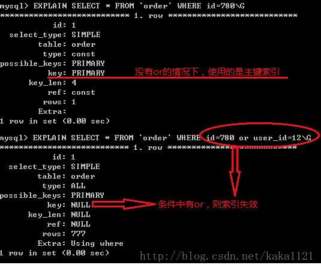
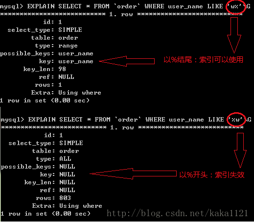
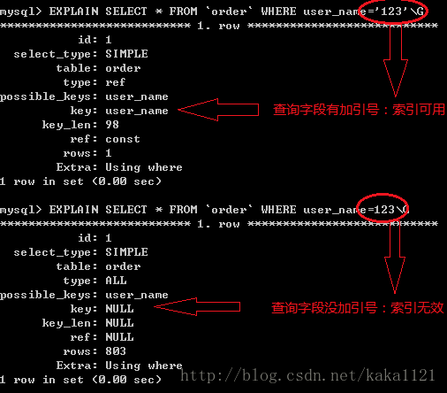
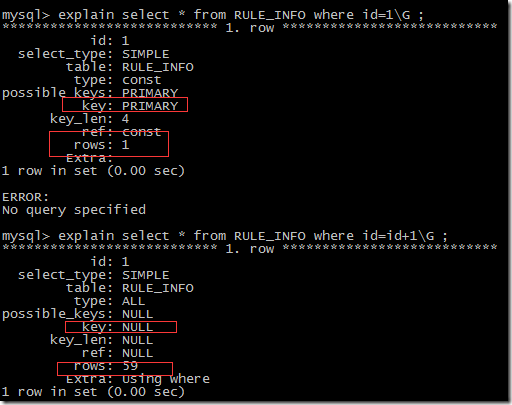
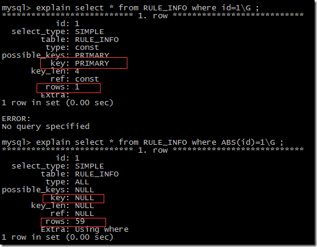

什么时候没用

1.有 or 必全有索引;

2.复合索引未用左列字段;

3.like 以% 开头;

4.需要类型转换;

5.where 中索引列有运算;

6.where 中索引列使用了函数;

7.如果 mysql 觉得全表扫描更快时（数据少）;

什么时没必要用

1.唯一性差;

2.频繁更新的字段不用（更新索引消耗）;

3.where 中不用的字段;

4.索引使用<>时，效果一般;

详述（转）

索引并不是时时都会生效的，比如以下几种情况，将导致索引失效：

- 如果条件中有 or，即使其中有部分条件带索引也不会使用 (这也是为什么尽量少用 or 的原因)，例子中 user_id 无索引

注意：要想使用 or，又想让索引生效，只能将 or 条件中的每个列都加上索引

- 对于复合索引，如果不使用前列，后续列也将无法使用，类电话簿。
- like 查询是以% 开头

- 存在索引列的数据类型隐形转换，则用不上索引，比如列类型是字符串，那一定要在条件中将数据使用引号引用起来,否则不使用索引

- where 子句里对索引列上有数学运算，用不上索引

- where 子句里对有索引列使用函数，用不上索引

- 如果 mysql 估计使用全表扫描要比使用索引快,则不使用索引

比如数据量极少的表

什么情况下不推荐使用索引？

1) 数据唯一性差（一个字段的取值只有几种时）的字段不要使用索引

比如性别，只有两种可能数据。意味着索引的二叉树级别少，多是平级。这样的二叉树查找无异于全表扫描。

2) 频繁更新的字段不要使用索引

比如 logincount 登录次数，频繁变化导致索引也频繁变化，增大数据库工作量，降低效率。

3) 字段不在 where 语句出现时不要添加索引,如果 where 后含 IS NULL /IS NOT NULL/ like ‘% 输入符%’等条件，不建议使用索引

只有在 where 语句出现，mysql 才会去使用索引

4） where 子句里对索引列使用不等于（<>），使用索引效果一般
