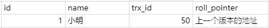
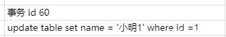
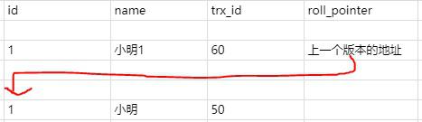
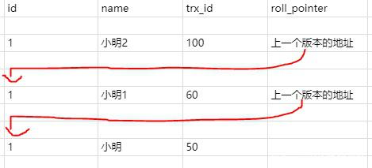
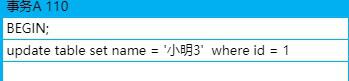
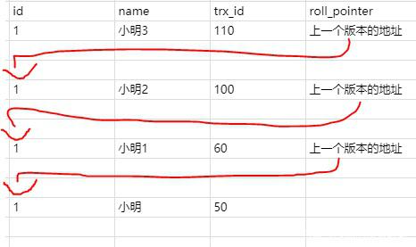

MVCC(Mutil-Version Concurrency Control)，就是多版本并发控制。MVCC 是一种并发控制的方法，一般在数据库管理系统中，实现对数据库的并发访问。

在 Mysql 的 InnoDB 引擎中就是指在已提交读 (READ COMMITTD) 和可重复读 (REPEATABLE READ) 这两种隔离级别下的事务对于 SELECT 操作会访问版本链中的记录的过程。

这就使得别的事务可以修改这条记录，反正每次修改都会在版本链中记录。SELECT 可以去版本链中拿记录，这就实现了读 - 写，写 - 读的并发执行，提升了系统的性能。

我们来具体看看是如何实现的。

版本链

我们先来理解一下版本链的概念。在 InnoDB 引擎表中，它的聚簇索引记录中有两个必要的隐藏列：

Internally, InnoDB adds three fields to each row stored in the database. A 6-byte DB_TRX_ID field indicates the transaction identifier for the last transaction that inserted or updated the row. Also, a deletion is treated internally as an update where a special bit in the row is set to mark it as deleted. Each row also contains a 7-byte DB_ROLL_PTR field called the roll pointer. The roll pointer points to an undo log record written to the rollback segment. If the row was updated, the undo log record contains the information necessary to rebuild the content of the row before it was updated. A 6-byte DB_ROW_ID field contains a row ID that increases monotonically as new rows are inserted. If InnoDB generates a clustered index automatically, the index contains row ID values. Otherwise, the DB_ROW_ID column does not appear in any index.

trx_id 这个 id 用来存储的每次对某条聚簇索引记录进行修改的时候的事务 id。

roll_pointer 每次对哪条聚簇索引记录有修改的时候，都会把老版本写入 undo 日志中。这个 roll_pointer 就是存了一个指针，它指向这条聚簇索引记录的上一个版本的位置，通过它来获得上一个版本的记录信息。(注意插入操作的 undo 日志没有这个属性，因为它没有老版本)

比如现在有个事务 id 是 60 的执行的这条记录的修改语句

此时在 undo 日志中就存在版本链

ReadView

说了版本链我们再来看看 ReadView。已提交读和可重复读的区别就在于它们生成 ReadView 的策略不同。

ReadView 中主要就是有个列表来存储我们系统中当前活跃着的读写事务，也就是 begin 了还未提交的事务。通过这个列表来判断记录的某个版本是否对当前事务可见。假设当前列表里的事务 id 为 [80,100]。

如果你要访问的记录版本的事务 id 为 50，比当前列表最小的 id80 小，那说明这个事务在之前就提交了，所以对当前活动的事务来说是可访问的。如果你要访问的记录版本的事务 id 为 70,发现此事务在列表 id 最大值和最小值之间，那就再判断一下是否在列表内，如果在那就说明此事务还未提交，所以版本不能被访问。如果不在那说明事务已经提交，所以版本可以被访问。如果你要访问的记录版本的事务 id 为 110，那比事务列表最大 id100 都大，那说明这个版本是在 ReadView 生成之后才发生的，所以不能被访问。这些记录都是去版本链里面找的，先找最近记录，如果最近这一条记录事务 id 不符合条件，不可见的话，再去找上一个版本再比较当前事务的 id 和这个版本事务 id 看能不能访问，以此类推直到返回可见的版本或者结束。

举个例子 ，在已提交读隔离级别下：

比如此时有一个事务 id 为 100 的事务，修改了 name,使得的 name 等于小明 2，但是事务还没提交。则此时的版本链是

那此时另一个事务发起了 select 语句要查询 id 为 1 的记录，那此时生成的 ReadView 列表只有 [100]。那就去版本链去找了，首先肯定找最近的一条，发现 trx_id 是 100,也就是 name 为小明 2 的那条记录，发现在列表内，所以不能访问。

这时候就通过指针继续找下一条，name 为小明 1 的记录，发现 trx_id 是 60，小于列表中的最小 id,所以可以访问，直接访问结果为小明 1。

那这时候我们把事务 id 为 100 的事务提交了，并且新建了一个事务 id 为 110 也修改 id 为 1 的记录，并且不提交事务

这时候版本链就是

这时候之前那个 select 事务又执行了一次查询,要查询 id 为 1 的记录。

这个时候关键的地方来了

如果你是已提交读隔离级别，这时候你会重新一个 ReadView，那你的活动事务列表中的值就变了，变成了 [110]。

按照上的说法，你去版本链通过 trx_id 对比查找到合适的结果就是小明 2。

如果你是可重复读隔离级别，这时候你的 ReadView 还是第一次 select 时候生成的 ReadView,也就是列表的值还是 [100]。所以 select 的结果是小明 1。所以第二次 select 结果和第一次一样，所以叫可重复读！

也就是说已提交读隔离级别下的事务在每次查询的开始都会生成一个独立的 ReadView,而可重复读隔离级别则在第一次读的时候生成一个 ReadView，之后的读都复用之前的 ReadView。

这就是 Mysql 的 MVCC,通过版本链，实现多版本，可并发读 - 写，写 - 读。通过 ReadView 生成策略的不同实现不同的隔离级别。

如有错误欢迎指正！
