B-Tree 就是我们常说的 B 树，一定不要读成 B 减树，否则就很丢人了。B 树这种数据结构常常用于实现数据库索引，因为它的查找效率比较高。

磁盘 IO 与预读

磁盘读取依靠的是机械运动，分为寻道时间、旋转延迟、传输时间三个部分，这三个部分耗时相加就是一次磁盘 IO 的时间，大概 9ms 左右。这个成本是访问内存的十万倍左右；正是由于磁盘 IO 是非常昂贵的操作，所以计算机操作系统对此做了优化：预读；每一次 IO 时，不仅仅把当前磁盘地址的数据加载到内存，同时也把相邻数据也加载到内存缓冲区中。因为局部预读原理说明：当访问一个地址数据的时候，与其相邻的数据很快也会被访问到。每次磁盘 IO 读取的数据我们称之为一页（page）。一页的大小与操作系统有关，一般为 4k 或者 8k。这也就意味着读取一页内数据的时候，实际上发生了一次磁盘 IO。

B-Tree 与二叉查找树的对比

　　我们知道二叉查找树查询的时间复杂度是 O（logN），查找速度最快和比较次数最少，既然性能已经如此优秀，但为什么实现索引是使用 B-Tree 而不是二叉查找树，关键因素是磁盘 IO 的次数。

数据库索引是存储在磁盘上，当表中的数据量比较大时，索引的大小也跟着增长，达到几个 G 甚至更多。当我们利用索引进行查询的时候，不可能把索引全部加载到内存中，只能逐一加载每个磁盘页，这里的磁盘页就对应索引树的节点。

一、 二叉树

我们先来看二叉树查找时磁盘 IO 的次：定义一个树高为 4 的二叉树，查找值为 10：

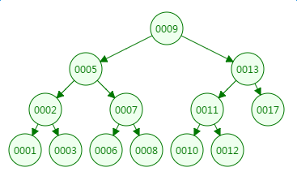

第一次磁盘 IO：

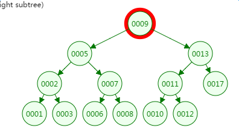

 第二次磁盘 IO

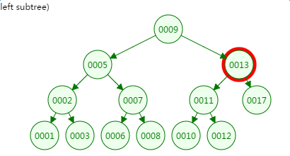

第三次磁盘 IO:

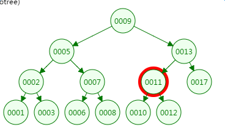

第四次磁盘 IO：

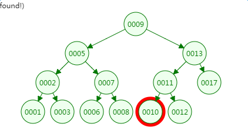

从二叉树的查找过程了来看，树的高度和磁盘 IO 的次数都是 4，所以最坏的情况下磁盘 IO 的次数由树的高度来决定。  从前面分析情况来看，减少磁盘 IO 的次数就必须要压缩树的高度，让瘦高的树尽量变成矮胖的树，所以 B-Tree 就在这样伟大的时代背景下诞生了。 

二、B-Tree

m 阶 B-Tree 满足以下条件：

1、每个节点最多拥有 m 个子树

2、根节点至少有 2 个子树

3、分支节点至少拥有 m/2 颗子树（除根节点和叶子节点外都是分支节点）

4、所有叶子节点都在同一层、每个节点最多可以有 m-1 个 key，并且以升序排列

 如下有一个 3 阶的 B 树，观察查找元素 21 的过程：

第一次磁盘 IO：     

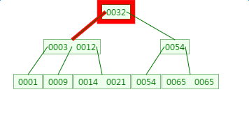

第二次磁盘 IO：

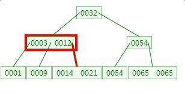

这里有一次内存比对：分别跟 3 与 12 比对

第三次磁盘 IO:

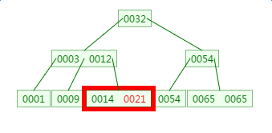

这里有一次内存比对，分别跟 14 与 21 比对

从查找过程中发现，B 树的比对次数和磁盘 IO 的次数与二叉树相差不了多少，所以这样看来并没有什么优势。

但是仔细一看会发现，比对是在内存中完成中，不涉及到磁盘 IO，耗时可以忽略不计。另外 B 树种一个节点中可以存放很多的 key（个数由树阶决定）。

相同数量的 key 在 B 树中生成的节点要远远少于二叉树中的节点，相差的节点数量就等同于磁盘 IO 的次数。这样到达一定数量后，性能的差异就显现出来了。

 三、B 树的新增

在刚才的基础上新增元素 4，它应该在 3 与 9 之间：

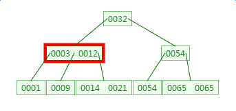

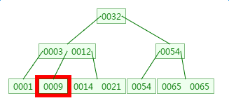

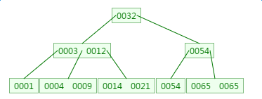

四、B 树的删除

 删除元素 9：

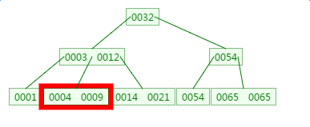

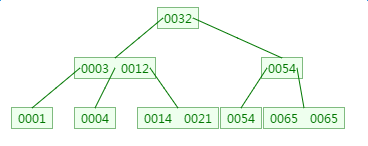

五、总结

　　插入或者删除元素都会导致节点发生裂变反应，有时候会非常麻烦，但正因为如此才让 B 树能够始终保持多路平衡，这也是 B 树自身的一个优势：自平衡；B 树主要应用于文件系统以及部分数据库索引，如 MongoDB，大部分关系型数据库索引则是使用 B+ 树实现。

来源： [https://www.cnblogs.com/dongguacai/p/7239599.html](https://www.cnblogs.com/dongguacai/p/7239599.html)
