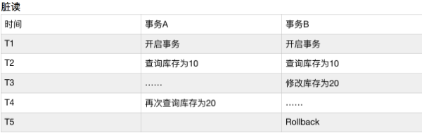
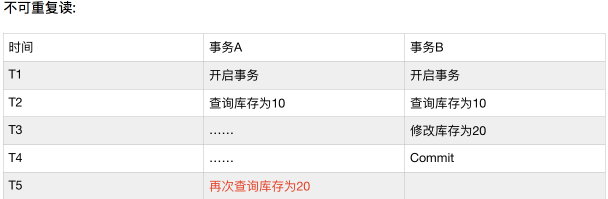
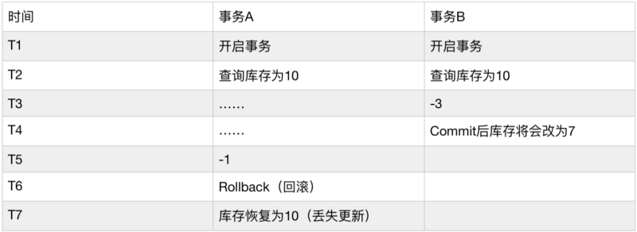
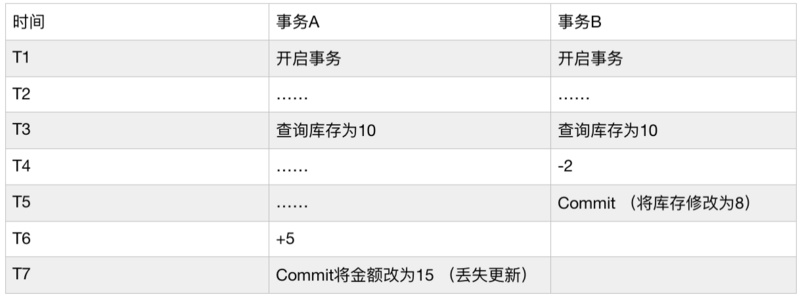

事务的概念

1. 事务 可以理解为一个 独立的工作单元, 在这个独立的工作单元中, 有一组操作; 放在事务 (独立工作单元) 中的多个操作, 要么全部执行成功, 要么全部执行失败。
2. 不免俗套, 这还是通过最经典的银行转账应用来解释一下

- 假设有两个角色 'Iron Man'(余额 500), 'Wolverine'(余额 15), 现在 Iron Man 通过该银行应用给 Wolverine 转账 100 元, 那么本次转账操作至少需要三个步骤:

检查 `Iron Man` 余额 `>=100` 元 从 `Iron Man` 余额中 `-100` 元 给 `Wolverine` 余额 `+100` 元

- 注意: 上面的三个步骤的操作必须打包在一个事务中, 从而可以作为一个 独立的工作单元 来执行。在这个 独立工作单元 (即事务) 中的这三个操作, 只要有任何一个操作失败, 则事务就整体就是失败的, 那就必须回滚所有的步骤。
- 假设第二步操作成功, 但是第三步操作失败, 那么整个事务也就应该是失败的, 那就必须将第二步的操作也回滚。(到这里我们也看到了事务最基本的特性之一: 保证数据的一致性)

3. 要知道, 在真实的高并发场景下, 事务需要做的事情其实很多很多, 因为高并发会出现很多意想不到的问题, 接下来会分析这些问题。

事务的 ACID 特性

在分析高并发事务的问题前, 我们要先知道事务的几个标准特性, 因为一个运行良好的事务处理系统必须具备这些标准特性, 而且这些问题的解决离不开事务的这几个标准特性!!!

1. Atomicity 原子性

一个事务必须被视为一个不可分割的最小工作单元, 整个事务中的所有操作要么全部提交成功, 要么全部失败回滚。对于一个事务来说, 不能只成功执行其中的一部分操作, 这就是事务的原子性。

2. Consistency 一致性

虽然可数据表中的数据可能一直在变化, 但是事务的一致性特性会保证 数据库总是从一个一致性的状态 转换到 另一个一致性的状态;

比如在之前的转账例子:

转账前的一致性状态是: 'Iron Man'(余额 500), 'Wolverine'(余额 15) 转账成功后的一致性状态是: 'Iron Man'(余额 400), 'Wolverine'(余额 115) 转账如果失败的话, 一致性的状态应该回滚到转账前的状态: 'Iron Man'(余额 500), 'Wolverine'(余额 15)

3. Isolation 隔离性

- 通常来说, 一个事务所做的修改在最终提交以前, 对其他事务是不可见的;

比如在之前的转账例子中, 在执行完成第二步, 但是第三步还没开始的时候, 此时有另一个账户汇总的程序开始运行, 那么这个程序所拿到的 A 账户余额应该是没有被 -100 的余额才对

- 后面我们还会详细讨论事务隔离性的 隔离级别, 到时候就知道这里为什么说通常来说对其他事务是不可见的; (也就是还有特例, 比如最低隔离级别 READ UNCOMMITTED, 对其他事务的可见就造成了脏读问题的出现)
- 事务有四种隔离级别 (从低到高: READ UNCOMMITTED, READ COMMITTED, REPEATABLE READ, SERIALIZABLE)

4. Durability 持久性

一旦事务被最终提交, 则在事务这个独立单元中的所有操作所做的修改将会 `永久保存到数据库中`; (这里所说的 `永久` 应该可以理解为 被事务修改的数据 是真正存放到了表中, 而不是存放在了诸如临时表之类的地方)

高并发事务的问题

在并发量比较大的时候, 很容易出现 多个事务同时进行 的情况。假设有两个事务正在同时进行, 值得注意的是: 它们两者之间是互相不知道对方的存在的, 各自都对自身所处的环境过分乐观, 从而并没有对自己所操作的数据做一定的保护处理, 所以最终导致了一些问题的出现;

接下来, 在分析高并发事务的问题时, 你可能已经了解了一些关于锁的概念, 但是在分析这些问题的时候, 先不要带入锁的概念, 本小节只会列出问题, 并直接告诉你各个问题是使用事务隔离性的哪个隔离级别解决掉的, 锁是解决方案, 如果带入锁的概念, 是无法去分析这些问题的。所以本节不需要带入锁!

[下一篇文章]() 将会分析这些解决方案 (各隔离级别) 具体是如何解决问题的。

脏读

1. 如果 mysql 中一个事务 A 读取了另一个并行事务 B 未最终提交的写数据, 那事务 A 的这次读取就是脏读。(因为事务 A 读取的是 ' 脏数据 ', 是 ' 非持久性 ' 的数据)

- 之所以说是 ' 非持久性数据 ', ' 脏数据 ', 是因为事务 B 最终可能会因为内部其他后续操作的失败或者系统后续突然崩溃等原因, 导致事务最终整体提交失败, 那么事务 A 此时读取到的数据在表中其实会被回滚, 那事务 A 拿到的自然就是脏的数据了。
- 图示:

2. 事务 A 在 T4 阶段读取库存为 20, 这个库存其实就属于脏数据, 因为事务 B 最终会回滚这个数据, 所以如果事务 A 使用库存 20 进行后续的操作, 就会引发问题, 因为事务 A 拿到的数据已经和表中的真实数据不一致了。
3. 那么这个问题如何解决呢?

在 MySQL 中, 其实事务已经用自身特性（隔离性的 -- READ COMMITED 或以上隔离级别）解决了这个问题;

**`READ COMMITED` 级别保证了, 只要是当前语句执行前已经提交的数据都是可见的**。注意和 `REPEATABLE READ` 级别的区!!!

不可重复读

1. 假设现在上面的 脏读问题 已经被完全解决了, 那就意味着事务中每次读取到的数据都是 持久性 的数据 (被别的事务最终 提交/回滚 完成后的数据)。
2. 但是你还需要知道的是: 解决了脏读问题, 只是能保证你在事务中每次读到的数据都是持久性的数据而已!!!!
3. 如果在一个事务中多次读取同一个数据, 正好在两次读取之间, 另外一个事务确实已经完成了对该数据的修改并提交, 那问题就来了: 可能会出现多次读取结果不一致的现象。

4. 那么这个问题如何解决呢?

在 MySQL 中, 其实事务已经用自身特性（隔离性的 -- REPEATABLE READ 或以上隔离级别）解决了这个问题;

REPEATABLE READ 级别保证了, 只要是当前事务执行前已经提交的数据都是可见的。注意和 READ COMMITED 级别的区!!!

幻读 (间隙锁)

对于幻读, 可能很多人经常和不可重复读区分不开, 详情可以参考本人写的此篇文章 [https://segmentfault.com/a/11...](https://segmentfault.com/a/1190000012669504)

更新丢失

1. 最后聊一下高并发事务的另一个问题 -- 丢失更新问题, 该问题和之前几个问题需要区分开, 因为解决方案不是一类!
2. 第一类丢失更新: A 事务撤销时, 把已经提交的 B 事务的更新数据覆盖了。

不过, 通过后面 [MVCC相关文章](https://segmentfault.com/a/1190000012650596) 最后的小结你会了解到, 这类更新丢失问题是不会出现的, 因为 InnoDB 存储引擎的隔离级别都使用了排他锁, 即使是 MVCC 也不是纯 MVCC, 也用到了排他锁! 这样的话事务 A 在未完成的时候, 其他事务是无法对事务 A 涉及到的数据做修改并提交的。

3. 第二类丢失更新: A 事务覆盖 B 事务已经提交的数据，造成 B 事务所做操作丢失。

此类更新丢失问题, 无法依靠前三种隔离级别来解决, 只能用最高隔离级别 Serializable 或者手动使用乐观锁, 悲观锁来解决。

4. 最高隔离级别 Serializable 在实际应用场景中并不被采用, 对于手动使用乐观锁, 悲观锁的方案, 将会在以后关于锁的文章中一并给出!
