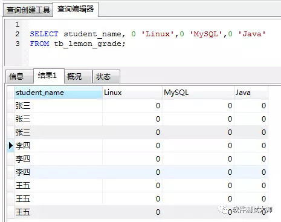

在我们的实际工作中，为了研发出功能完整、系统健壮的软件，需要我们测试人员想法设法的去挑出软件的问题，所以很多公司对测试人员的要求甚至高于开发人员，而通过 SQL 语句的编写，测试人员可以去进行数据查询、数据正确性完整性验证、构造测试数据、或者行破坏测试或压力测试。因此，作为一个测试人员，掌握 SQL 的重要性就不言而喻了。在我们的面试过程中，会碰到各种数据库或者编写 SQL 的面试题。

来看下面这道难倒众生的经典面试题

面试题：行列转换

柠檬班第 30 期学生要毕业了，他们 Linux、MySQL、Java 成绩保存在数据表 tb_lemon_grade 中，表中字段 id，student_name，course，score 分别表示成绩 id，学生姓名，课程名称，课程成绩，表中数据表 1 所示。请写出一条 SQL，将表 1 的数据变成表 2 的形式

id 学生姓名课程名称课程成绩

1 张三 Linux 85

2 张三 MySQL 92

3 张三 Java 87

4 李四 Linux 96

5 李四 MySQL 89

6 李四 Java 100

7 王五 Linux 91

8 王五 MySQL 83

9 王五 Java 98

表 1

学生姓名 LinuxMySQLJava

张三 85 92 87

李四 96 89 100

王五 91 83 98

表 2

一：创建表

CREATE TABLE tb_lemon_grade (

id INT(10) NOT NULL AUTO_INCREMENT PRIMARY KEY,

student_name VARCHAR(20) DEFAULT NULL,

course VARCHAR(20) DEFAULT NULL,

score FLOAT DEFAULT '0');

二：初始化数据

INSERT INTO tb_lemon_grade (student_name, course, score) VALUES

(" 张三 ", "Linux", 85),

(" 张三 ", "MySQL", 92),

(" 张三 ", "Java", 87),

(" 李四 ", "Linux", 96),

(" 李四 ", "MySQL", 89),

(" 李四 ", "Java", 100),

(" 王五 ", "Linux", 91),

(" 王五 ", "MySQL", 83),

(" 王五 ", "Java", 98);

三：首先我们查询出所有数据,这个结果和我们的图 1 是一样的

select * from tb_lemon_grade;

四：使用常量列输出我们的目标结构

可以看到结果已经和我们的图二非常接近了

五：使用 IF 函数，替换我们的常量列，将成绩赋值到对应行的对应列

SELECT student_name,

IF(COURSE = 'Linux',SCORE,0) 'Linux',

IF(COURSE = 'MySQL',SCORE,0) 'MySQL',

IF(COURSE = 'Java',SCORE,0) 'Java'

FROM tb_lemon_grade;

运行 SQL，结果如下所示：

图片

六：我们来分析这个结果集，

在原始结构中，每一行表示了某个同学某一个科的成绩，以第一行为例，第一行是张三同学 Linux 的成绩，所以我们结果集中 Linux 有成绩为 85，而其他两列 MySQL 和 Java 作为常量列，成绩为 0。

再分析每个同学的成绩的所有行，如下图所示，每个方块内包含行中，就有该同学这门课程的成绩，并且该方块内其余行的成绩值为 0。因此，不难想到，我们可以使用分组，通过分组提取出每科的成绩

七：分组，使用 MAX 函数取出最大值

（因为其中只有一行成绩为真实成绩，其他行值为 0，所以最大值就是真实成绩）

SELECT student_name,

MAX(IF(COURSE = 'Linux',SCORE,0)) 'Linux',

MAX(IF(COURSE = 'MySQL',SCORE,0)) 'MySQL',

MAX(IF(COURSE = 'Java',SCORE,0)) 'Java'

FROM tb_lemon_grade

GROUP BY student_name;

图片

八：也可以分组后，对每行数据进行求和，使用 SUM 函数，语句和结果如下：

SELECT student_name,

SUM(IF(COURSE = 'Linux',SCORE,0)) 'Linux',

SUM(IF(COURSE = 'MySQL',SCORE,0)) 'MySQL',

SUM(IF(COURSE = 'Java',SCORE,0)) 'Java'

FROM tb_lemon_grade

GROUP BY student_name;

图片

九：既然使用 IF 语句可以达到效果，那使用 CASE 语句也是同样的效果

分组，使用 MAX 聚合函数

SELECT student_name,

max(CASE COURSE when 'Linux' THEN SCORE ELSE 0 END) as 'Linux',

max(CASE COURSE when 'MySQL' THEN SCORE ELSE 0 END) as 'MySQL',

max(CASE COURSE when 'Java' THEN SCORE ELSE 0 END) as 'Java'

FROM tb_lemon_grade

GROUP BY student_name;

结果如下图所示：

使用 SUM，结果如下图所示

SELECT student_name,

SUM(CASE COURSE when 'Linux' THEN SCORE ELSE 0 END) as 'Linux',

SUM(CASE COURSE when 'MySQL' THEN SCORE ELSE 0 END) as 'MySQL',

SUM(CASE COURSE when 'Java' THEN SCORE ELSE 0 END) as 'Java'

FROM tb_lemon_grade

GROUP BY student_name;

图片

---------------------

作者：ningmengban

来源：CSDN

原文：https://blog.csdn.net/ningmengban/article/details/76489886

版权声明：本文为博主原创文章，转载请附上博文链接！
