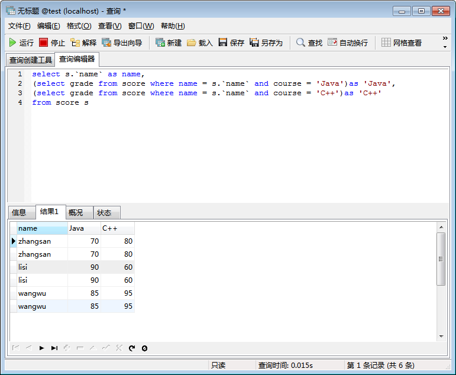
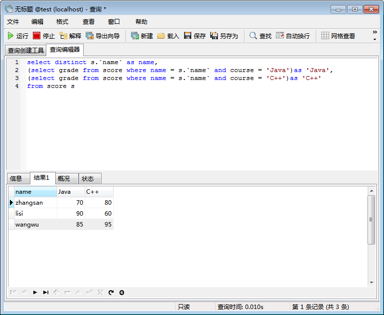
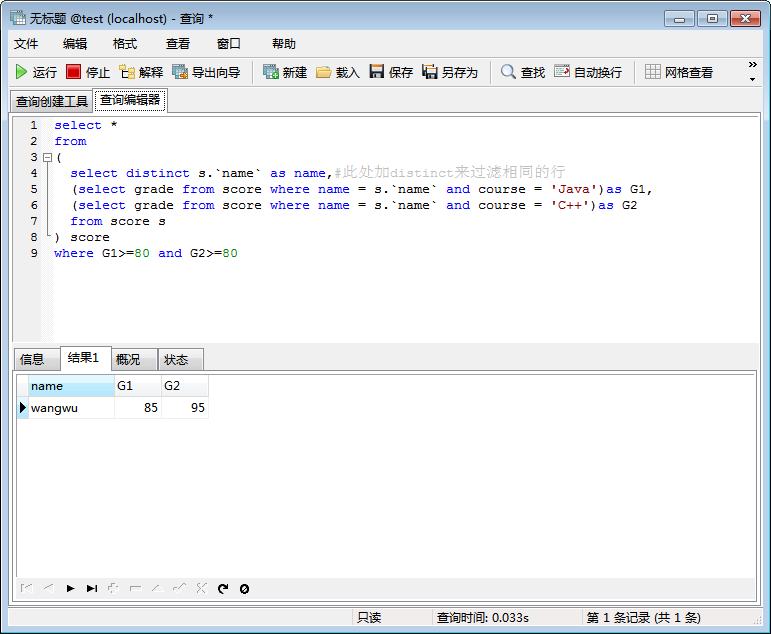
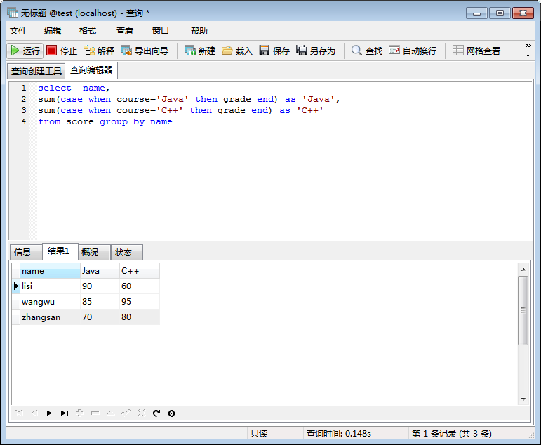
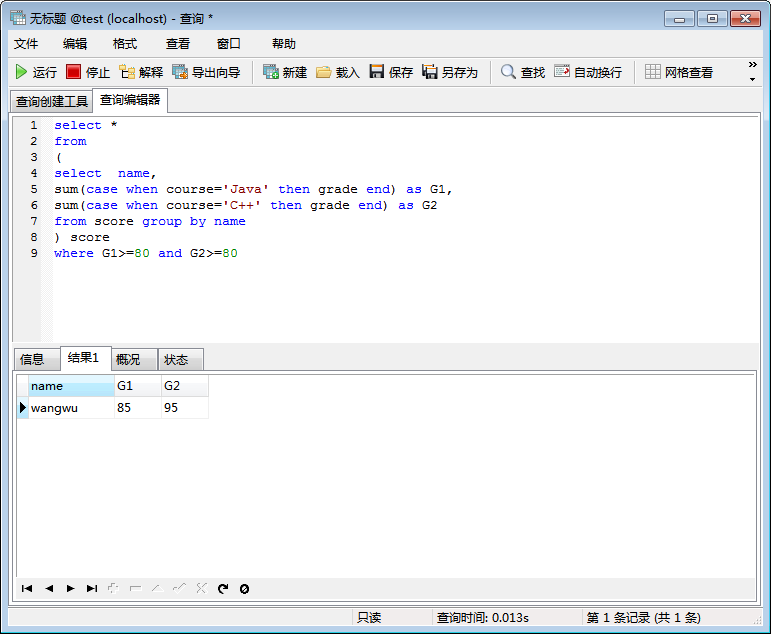
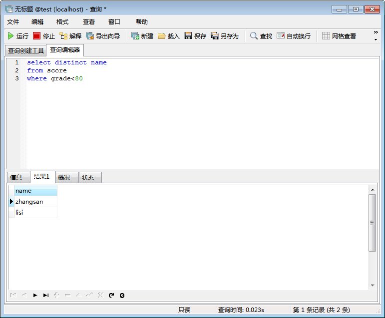
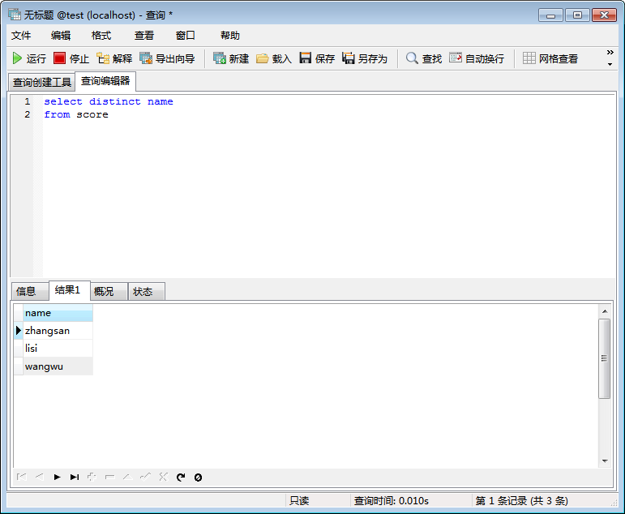
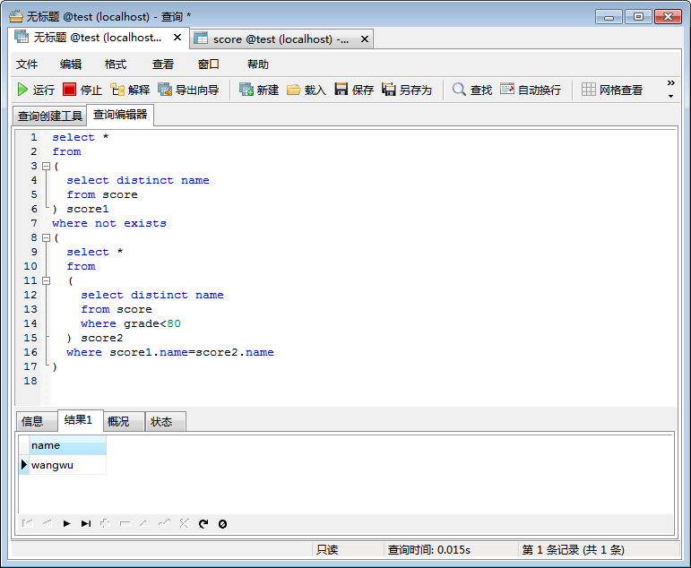

问题场景

最近有个朋友去面试，问了我一道面试题。题目如下，在形如下面的数据库表 score 中，找出每门成绩（grade）都大于等于 80 分的学生姓名。

----------------------------------------

name 　　   | course  | grade

----------------------------------------

zhangsan  | Java　  | 70

----------------------------------------

zhangsan  | C++　   | 80

----------------------------------------

lisi 　   | Java　  | 90

----------------------------------------

lisi 　   | C++ 　  | 60

----------------------------------------

wangwu　  | Java　  | 85

----------------------------------------

wangwu　  | C++　　 | 95

----------------------------------------

期望结果

----------------------------------------

name

----------------------------------------

wangwu

----------------------------------------

本文以 MySQL 数据库为例，以三种方案一步一步实现面试题要求。

方案一

1、寻求行列转换，也称矩阵转置，将多列数据转为一行，这一步最关键，实现 SQL 语句如下：

下面的 sql 是以 score 为主表来构建多列，构造的从表为每门课程的数据表，通过主表的 name 字段来关联从表的 name 字段。

select s.`name` as name, (select grade from score where name = s.`name` and course = 'Java')as 'Java', (select grade from score where name = s.`name` and course = 'C++')as 'C++' from score s

运行结果截图：

2、对于 1 的执行结果，需要过滤掉重复的行，只要通过 distinct 关键字就可以了，实现 SQL 语句如下：

select distinct s.`name` as name,#此处加 distinct 来过滤相同的行 (select grade from score where name = s.`name` and course = 'Java')as 'Java', (select grade from score where name = s.`name` and course = 'C++')as 'C++' from score s

运行结果截图：

3、最后通过构造一个子查询，即是把上面 2 的查询结果作为一个表来查询，进行 where 行级过滤就可以了，实现 SQL 语句如下：

select * from ( select distinct s.`name` as name,#此处加 distinct 来过滤相同的行 (select grade from score where name = s.`name` and course = 'Java')as G1, (select grade from score where name = s.`name` and course = 'C++')as G2 from score s ) score where G1>=80 and G2>=80

运行结果截图：

问题：这里有一个问题指出下，如果写成如下的 sql 语句，把 Java 和 C++ 作为列名的话（还有 C#），查询结果为 NULL，这个问题后续会详解，请见运行结果截图：

select * from ( select distinct s.`name` as name,#此处加 distinct 来过滤相同的行 (select grade from score where name = s.`name` and course = 'Java')as 'Java', (select grade from score where name = s.`name` and course = 'C++')as 'C++' from score s ) score where 'Java'>=80 and 'C++'>=80

运行结果截图：

方案二

1、通过 group 和聚合函数 sum 的结合使用，通过 group by name 分组，利用 sum 假模假样计算出每门课程的成绩，sum 的时候利用 case 判断课程类别，就得到了以行显示的每个学生的每门课程成绩，这一步最关键，实现 SQL 语句如下：

select name, sum(case when course='Java' then grade end) as 'Java', sum(case when course='C++' then grade end) as 'C++' from score group by name

运行结果截图：

2、再通过构造一个子查询，即是把上面 1 的查询结果作为一个表来查询，进行 where 行级过滤就可以了，实现 SQL 语句如下：

select * from ( select name, sum(case when course='Java' then grade end) as G1, sum(case when course='C++' then grade end) as G2 from score group by name ) score where G1>=80 and G2>=80

运行结果截图：

方案三

1、先找出有任意课程<80 分的学生，实现 SQL 语句如下：

select distinct name from score where grade<80

运行结果截图：

2、distinct 出所有学生列表（不重复），实现 SQL 语句如下：

select distinct name from score

运行结果截图：

3、通过构造子查询从查询 2 的结果排除出去查询 1 的结果，这一步骤有的数据库是有集合函数，比如 SQL Server 的 Except，这儿我们用 not exists 进行行级过滤，实现 SQL 语句如下：

select * from ( select distinct name from score ) score1 where not exists ( select * from ( select distinct name from score where grade<80 ) score2 where score1.name=score2.name )

运行结果截图：

总结

个人推荐第二种方案，第三种方案也不错，随着课程数的增多，第一种方案的执行效率理论上会很差，光第一步就要执行 M*N（M-score 表记录数，N- 课程数）次关联。

思考

现实中数据更倾向于下面的情形。对于此问题场景，规则的数据是很好处理的（即每位学生都仅有 Java、C++ 两门课程的成绩），但是考虑现实生活场景，每位学生由于专业或者兴趣差异，选修的课程可能不一样，所以有些课程是没有成绩的（学生没有某些课程成绩，但是在行列转换的时候会生成此门课程成绩为 NULL 的行记录的列，这部分课程是不适用大于等于 80 分这个条件，是不参与这个条件过滤的）。sql 要做下处理，不过实现思路同上述三种方案。

----------------------------------------

name 　　  | course  | grade

----------------------------------------

zhangsan  | Java　  | 70

----------------------------------------

zhangsan  | C++　   | 80

----------------------------------------

lisi 　   | Python　| 90

----------------------------------------

lisi 　   | C#  　  | 60

----------------------------------------

wangwu　  | iOS 　  | 85

----------------------------------------

wangwu　  | Android | 95

----------------------------------------

数据库脚本

/*

Navicat MySQL Data Transfer

Source Server : localhost

Source Server Version : 50538

Source Host : 127.0.0.1

Source Database : test

Target Server Type : MYSQL

Target Server Version : 50538

File Encoding : 65001

Date: 2017-08-22 16:40:30

*/

SET FOREIGN_KEY_CHECKS=0;

-- ----------------------------

-- Table structure for `score`

-- ----------------------------

DROP TABLE IF EXISTS `score`;

CREATE TABLE `score` (

`name` varchar(20) DEFAULT NULL,

`course` varchar(20) DEFAULT NULL,

`grade` int(11) DEFAULT NULL

) ENGINE=InnoDB DEFAULT CHARSET=utf8;

-- ----------------------------

-- Records of score

-- ----------------------------

INSERT INTO `score` VALUES ('zhangsan', 'Java', '70');

INSERT INTO `score` VALUES ('zhangsan', 'C++', '80');

INSERT INTO `score` VALUES ('lisi', 'Java', '90');

INSERT INTO `score` VALUES ('lisi', 'C++', '60');

INSERT INTO `score` VALUES ('wangwu', 'Java', '85');

INSERT INTO `score` VALUES ('wangwu', 'C++', '95');
