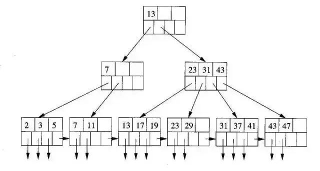
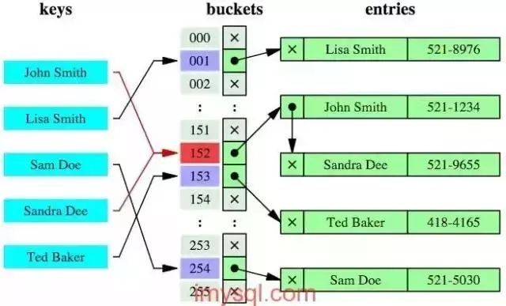
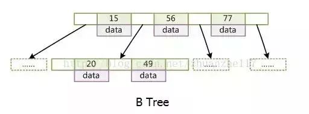
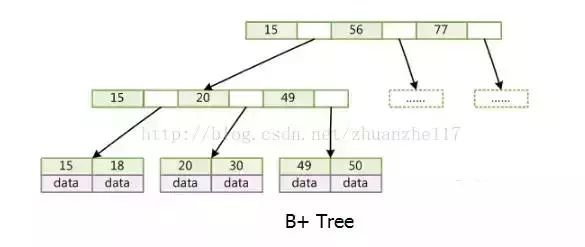

一、为什么用自增列作为主键

1、如果我们定义了主键 (PRIMARY KEY)，那么 InnoDB 会选择主键作为聚集索引、如果没有显式定义主键，则 InnoDB 会选择第一个不包含有 NULL 值的唯一索引作为主键索引、如果也没有这样的唯一索引，则 InnoDB 会选择内置 6 字节长的 ROWID 作为隐含的聚集索引 (ROWID 随着行记录的写入而主键递增，这个 ROWID 不像 ORACLE 的 ROWID 那样可引用，是隐含的)。

2、数据记录本身被存于主索引（一颗 B+Tree）的叶子节点上。这就要求同一个叶子节点内（大小为一个内存页或磁盘页）的各条数据记录按主键顺序存放，因此每当有一条新的记录插入时，MySQL 会根据其主键将其插入适当的节点和位置，如果页面达到装载因子（InnoDB 默认为 15/16），则开辟一个新的页（节点）

3、如果表使用自增主键，那么每次插入新的记录，记录就会顺序添加到当前索引节点的后续位置，当一页写满，就会自动开辟一个新的页

4、如果使用非自增主键（如果身份证号或学号等），由于每次插入主键的值近似于随机，因此每次新纪录都要被插到现有索引页得中间某个位置，此时 MySQL 不得不为了将新记录插到合适位置而移动数据，甚至目标页面可能已经被回写到磁盘上而从缓存中清掉，此时又要从磁盘上读回来，这增加了很多开销，同时频繁的移动、分页操作造成了大量的碎片，得到了不够紧凑的索引结构，后续不得不通过 OPTIMIZE TABLE 来重建表并优化填充页面。

二、为什么使用数据索引能提高效率

1、数据索引的存储是有序的

2、在有序的情况下，通过索引查询一个数据是无需遍历索引记录的

3、极端情况下，数据索引的查询效率为二分法查询效率，趋近于 log2(N)

三、B+ 树索引和哈希索引的区别

B+ 树是一个平衡的多叉树，从根节点到每个叶子节点的高度差值不超过 1，而且同层级的节点间有指针相互链接，是有序的

哈希索引就是采用一定的哈希算法，把键值换算成新的哈希值，检索时不需要类似 B+ 树那样从根节点到叶子节点逐级查找，只需一次哈希算法即可,是无序的

四、哈希索引的优势：

1、等值查询。哈希索引具有绝对优势（前提是：没有大量重复键值，如果大量重复键值时，哈希索引的效率很低，因为存在所谓的哈希碰撞问题。）

五、哈希索引不适用的场景：

1、不支持范围查询

2、不支持索引完成排序

3、不支持联合索引的最左前缀匹配规则

通常，B+ 树索引结构适用于绝大多数场景，像下面这种场景用哈希索引才更有优势：

在 HEAP 表中，如果存储的数据重复度很低（也就是说基数很大），对该列数据以等值查询为主，没有范围查询、没有排序的时候，特别适合采用哈希索引，例如这种 SQL：

select id,name from table where name=' 李明 '; — 仅等值查询

而常用的 InnoDB 引擎中默认使用的是 B+ 树索引，它会实时监控表上索引的使用情况，如果认为建立哈希索引可以提高查询效率，则自动在内存中的“自适应哈希索引缓冲区”建立哈希索引（在 InnoDB 中默认开启自适应哈希索引），通过观察搜索模式，MySQL 会利用 index key 的前缀建立哈希索引，如果一个表几乎大部分都在缓冲池中，那么建立一个哈希索引能够加快等值查询。

注意：在某些工作负载下，通过哈希索引查找带来的性能提升远大于额外的监控索引搜索情况和保持这个哈希表结构所带来的开销。但某些时候，在负载高的情况下，自适应哈希索引中添加的 read/write 锁也会带来竞争，比如高并发的 join 操作。like 操作和% 的通配符操作也不适用于自适应哈希索引，可能要关闭自适应哈希索引。

六、B 树和 B+ 树的区别

1、B 树，每个节点都存储 key 和 data，所有节点组成这棵树，并且叶子节点指针为 nul，叶子结点不包含任何关键字信息。

2、B+ 树，所有的叶子结点中包含了全部关键字的信息，及指向含有这些关键字记录的指针，且叶子结点本身依关键字的大小自小而大的顺序链接，所有的非终端结点可以看成是索引部分，结点中仅含有其子树根结点中最大（或最小）关键字。 (而 B 树的非终节点也包含需要查找的有效信息)

七、为什么说 B+ 比 B 树更适合实际应用中操作系统的文件索引和数据库索引？

1、B+ 的磁盘读写代价更低 B+ 的内部结点并没有指向关键字具体信息的指针。因此其内部结点相对 B 树更小。如果把所有同一内部结点的关键字存放在同一盘块中，那么盘块所能容纳的关键字数量也越多。一次性读入内存中的需要查找的关键字也就越多。相对来说 IO 读写次数也就降低了。

2、B+-tree 的查询效率更加稳定由于非终结点并不是最终指向文件内容的结点，而只是叶子结点中关键字的索引。所以任何关键字的查找必须走一条从根结点到叶子结点的路。所有关键字查询的路径长度相同，导致每一个数据的查询效率相当。

八、MySQL 联合索引

1、联合索引是两个或更多个列上的索引。对于联合索引:Mysql 从左到右的使用索引中的字段，一个查询可以只使用索引中的一部份，但只能是最左侧部分。例如索引是 key index (a,b,c). 可以支持 a 、 a,b 、 a,b,c 3 种组合进行查找，但不支持 b,c 进行查找 .当最左侧字段是常量引用时，索引就十分有效。

2、利用索引中的附加列，您可以缩小搜索的范围，但使用一个具有两列的索引 不同于使用两个单独的索引。复合索引的结构与电话簿类似，人名由姓和名构成，电话簿首先按姓氏对进行排序，然后按名字对有相同姓氏的人进行排序。如果您知 道姓，电话簿将非常有用；如果您知道姓和名，电话簿则更为有用，但如果您只知道名不姓，电话簿将没有用处。

九、什么情况下应不建或少建索引

1、表记录太少

2、经常插入、删除、修改的表

3、数据重复且分布平均的表字段，假如一个表有 10 万行记录，有一个字段 A 只有 T 和 F 两种值，且每个值的分布概率大约为 50%，那么对这种表 A 字段建索引一般不会提高数据库的查询速度。

4、经常和主字段一块查询但主字段索引值比较多的表字段

十、什么是表分区？

表分区，是指根据一定规则，将数据库中的一张表分解成多个更小的，容易管理的部分。从逻辑上看，只有一张表，但是底层却是由多个物理分区组成。

十一、表分区与分表的区别

分表：指的是通过一定规则，将一张表分解成多张不同的表。比如将用户订单记录根据时间成多个表。

分表与分区的区别在于：分区从逻辑上来讲只有一张表，而分表则是将一张表分解成多张表。

十二、表分区有什么好处？

1、分区表的数据可以分布在不同的物理设备上，从而高效地利用多个硬件设备。 2. 和单个磁盘或者文件系统相比，可以存储更多数据

2、优化查询。在 where 语句中包含分区条件时，可以只扫描一个或多个分区表来提高查询效率；涉及 sum 和 count 语句时，也可以在多个分区上并行处理，最后汇总结果。

3、分区表更容易维护。例如：想批量删除大量数据可以清除整个分区。

4、可以使用分区表来避免某些特殊的瓶颈，例如 InnoDB 的单个索引的互斥访问，ext3 问价你系统的 inode 锁竞争等。

十三、分区表的限制因素

1、一个表最多只能有 1024 个分区

2、MySQL5.1 中，分区表达式必须是整数，或者返回整数的表达式。在 MySQL5.5 中提供了非整数表达式分区的支持。

3、如果分区字段中有主键或者唯一索引的列，那么多有主键列和唯一索引列都必须包含进来。即：分区字段要么不包含主键或者索引列，要么包含全部主键和索引列。

4、分区表中无法使用外键约束

5、MySQL 的分区适用于一个表的所有数据和索引，不能只对表数据分区而不对索引分区，也不能只对索引分区而不对表分区，也不能只对表的一部分数据分区。

十四、如何判断当前 MySQL 是否支持分区？

命令：show variables like '%partition%' 运行结果:

mysql> show variables like '%partition%';

+-------------------+-------+| Variable_name | Value |+-------------------+-------+| have_partitioning | YES |+-------------------+-------+1 row in set (0.00 sec)

have_partintioning 的值为 YES，表示支持分区。

十五、MySQL 支持的分区类型有哪些？

1、RANGE 分区： 这种模式允许将数据划分不同范围。例如可以将一个表通过年份划分成若干个分区

2、LIST 分区： 这种模式允许系统通过预定义的列表的值来对数据进行分割。按照 List 中的值分区，与 RANGE 的区别是，range 分区的区间范围值是连续的。

3、HASH 分区 ：这中模式允许通过对表的一个或多个列的 Hash Key 进行计算，最后通过这个 Hash 码不同数值对应的数据区域进行分区。例如可以建立一个对表主键进行分区的表。

4、KEY 分区 ：上面 Hash 模式的一种延伸，这里的 Hash Key 是 MySQL 系统产生的。

十六、四种隔离级别

1、Serializable (串行化)：可避免脏读、不可重复读、幻读的发生。

2、Repeatable read (可重复读)：可避免脏读、不可重复读的发生。

3、Read committed (读已提交)：可避免脏读的发生。

4、Read uncommitted (读未提交)：最低级别，任何情况都无法保证。

十七、关于 MVVC

MySQL InnoDB 存储引擎，实现的是基于多版本的并发控制协议——MVCC (Multi-Version Concurrency Control) (注：与 MVCC 相对的，是基于锁的并发控制，Lock-Based Concurrency Control)。MVCC 最大的好处：读不加锁，读写不冲突。在读多写少的 OLTP 应用中，读写不冲突是非常重要的，极大的增加了系统的并发性能，现阶段几乎所有的 RDBMS，都支持了 MVCC。

1、LBCC：Lock-Based Concurrency Control，基于锁的并发控制。

2、MVCC：Multi-Version Concurrency Control，基于多版本的并发控制协议。纯粹基于锁的并发机制并发量低，MVCC 是在基于锁的并发控制上的改进，主要是在读操作上提高了并发量。

十八、在 MVCC 并发控制中，读操作可以分成两类：

1、快照读 (snapshot read)：读取的是记录的可见版本 (有可能是历史版本)，不用加锁（共享读锁 s 锁也不加，所以不会阻塞其他事务的写）。

2、当前读 (current read)：读取的是记录的最新版本，并且，当前读返回的记录，都会加上锁，保证其他事务不会再并发修改这条记录。

十九、行级锁定的优点：

1、当在许多线程中访问不同的行时只存在少量锁定冲突。

2、回滚时只有少量的更改

3、可以长时间锁定单一的行。

二十、行级锁定的缺点：

1、比页级或表级锁定占用更多的内存。

2、当在表的大部分中使用时，比页级或表级锁定速度慢，因为你必须获取更多的锁。

3、如果你在大部分数据上经常进行 GROUP BY 操作或者必须经常扫描整个表，比其它锁定明显慢很多。

4、用高级别锁定，通过支持不同的类型锁定，你也可以很容易地调节应用程序，因为其锁成本小于行级锁定。

二十一、MySQL 优化

1、开启查询缓存，优化查询

2、explain 你的 select 查询，这可以帮你分析你的查询语句或是表结构的性能瓶颈。EXPLAIN 的查询结果还会告诉你你的索引主键被如何利用的，你的数据表是如何被搜索和排序的

3、当只要一行数据时使用 limit 1，MySQL 数据库引擎会在找到一条数据后停止搜索，而不是继续往后查少下一条符合记录的数据

4、为搜索字段建索引

5、使用 ENUM 而不是 VARCHAR，如果你有一个字段，比如“性别”，“国家”，“民族”，“状态”或“部门”，你知道这些字段的取值是有限而且固定的，那么，你应该使用 ENUM 而不是 VARCHAR。

6、Prepared StatementsPrepared Statements 很像存储过程，是一种运行在后台的 SQL 语句集合，我们可以从使用 prepared statements 获得很多好处，无论是性能问题还是安全问题。Prepared Statements 可以检查一些你绑定好的变量，这样可以保护你的程序不会受到“SQL 注入式”攻击

7、垂直分表

8、选择正确的存储引擎

二十二、key 和 index 的区别

1、key 是数据库的物理结构，它包含两层意义和作用，一是约束（偏重于约束和规范数据库的结构完整性），二是索引（辅助查询用的）。包括 primary key, unique key, foreign key 等

2、index 是数据库的物理结构，它只是辅助查询的，它创建时会在另外的表空间（mysql 中的 innodb 表空间）以一个类似目录的结构存储。索引要分类的话，分为前缀索引、全文本索引等；

二十三、Mysql 中 MyISAM 和 InnoDB 的区别有哪些？

区别：

1、InnoDB 支持事务，MyISAM 不支持，对于 InnoDB 每一条 SQL 语言都默认封装成事务，自动提交，这样会影响速度，所以最好把多条 SQL 语言放在 begin 和 commit 之间，组成一个事务；

2、InnoDB 支持外键，而 MyISAM 不支持。对一个包含外键的 InnoDB 表转为 MYISAM 会失败；

3、InnoDB 是聚集索引，数据文件是和索引绑在一起的，必须要有主键，通过主键索引效率很高。但是辅助索引需要两次查询，先查询到主键，然后再通过主键查询到数据。因此，主键不应该过大，因为主键太大，其他索引也都会很大。而 MyISAM 是非聚集索引，数据文件是分离的，索引保存的是数据文件的指针。主键索引和辅助索引是独立的。

4、InnoDB 不保存表的具体行数，执行 select count(*) from table 时需要全表扫描。而 MyISAM 用一个变量保存了整个表的行数，执行上述语句时只需要读出该变量即可，速度很快；

5、Innodb 不支持全文索引，而 MyISAM 支持全文索引，查询效率上 MyISAM 要高；

如何选择：

1、是否要支持事务，如果要请选择 innodb，如果不需要可以考虑 MyISAM；

2、如果表中绝大多数都只是读查询，可以考虑 MyISAM，如果既有读写也挺频繁，请使用 InnoDB。

3、系统奔溃后，MyISAM 恢复起来更困难，能否接受；

4、MySQL5.5 版本开始 Innodb 已经成为 Mysql 的默认引擎 (之前是 MyISAM)，说明其优势是有目共睹的，如果你不知道用什么，那就用 InnoDB，至少不会差。

二十四、数据库表创建注意事项

1、字段名及字段配制合理性

- 剔除关系不密切的字段；
- 字段命名要有规则及相对应的含义（不要一部分英文，一部分拼音，还有类似 a.b.c 这样不明含义的字段）；
- 字段命名尽量不要使用缩写（大多数缩写都不能明确字段含义）；
- 字段不要大小写混用（想要具有可读性，多个英文单词可使用下划线形式连接）；
- 字段名不要使用保留字或者关键字；
- 保持字段名和类型的一致性；
- 慎重选择数字类型；
- 给文本字段留足余量；

2、系统特殊字段处理及建成后建议

- 添加删除标记（例如操作人、删除时间）；
- 建立版本机制；

3、表结构合理性配置

- 多型字段的处理，就是表中是否存在字段能够分解成更小独立的几部分（例如：人可以分为男人和女人）；
- 多值字段的处理，可以将表分为三张表，这样使得检索和排序更加有调理，且保证数据的完整性！

4、其它建议

- 对于大数据字段，独立表进行存储，以便影响性能（例如：简介字段）；
- 使用 varchar 类型代替 char，因为 varchar 会动态分配长度，char 指定长度是固定的；
- 给表创建主键，对于没有主键的表，在查询和索引定义上有一定的影响；
- 避免表字段运行为 null，建议设置默认值（例如：int 类型设置默认值为 0）在索引查询上，效率立显；
- 建立索引，最好建立在唯一和非空的字段上，建立太多的索引对后期插入、更新都存在一定的影响（考虑实际情况来创建）；

mysql 中 char 与 varchar 的区别分析

字符应该是最常见的一种了，但似乎各个数据库都有所不同，比如 oracle 中就有啥 varchar2 之类。不过 mysql 似乎最多的还是集中在 char 和 varchar 上。

说说区别。char 是固定长度的，而 varchar 会根据具体的长度来使用存储空间。比如 char(255) 和 varchar(255)，在存储字符串 "hello world" 的时候，char 会用一块 255 的空间放那个 11 个字符，而 varchar 就不会用 255 个，他先计算长度后只用 11 个再加上计算的到字符串长度信息，一般 1-2 个 byte 来，这样 varchar 在存储不确定长度的时候会大大减少存储空间。

如此看来 varchar 比 char 聪明多了，那 char 有用武之地吗？还是很不少优势的。

一，存储很短的信息，比如门牌号码 101，201……这样很短的信息应该用 char，因为 varchar 还要占个 byte 用于存储信息长度，本来打算节约存储的现在得不偿失。

二，固定长度的。比如使用 uuid 作为主键，那用 char 应该更合适。因为他固定长度，varchar 动态根据长度的特性就消失了，而且还要占个长度信息。

三，十分频繁改变的 column。因为 varchar 每次存储都要有额外的计算，得到长度等工作，如果一个非常频繁改变的，那就要有很多的精力用于计算，而这些对于 char 来说是不需要的。

还有一个关于 varchar 的问题是，varchar 他既然可以自动适应存储空间，那我 varchar(8) 和 varchar(255) 存储应该都是一样的，那每次表设计的时候往大的方向去好了，免得以后不够用麻烦。这个思路对吗？答案是否定的。mysql 会把表信息放到内存中（查询第一次后，就缓存住了，linux 下很明显，但 windows 下似乎没有，不知道为啥），这时内存的申请是按照固定长度来的，如果 varchar 很大就会有问题。所以还是应该按需索取。

- 情况：现需要存储一个地址信息，根据评估，只要使用 90 个字符。
- 问题：Varchar 数据类型是根据实际的需要来分配长度的，所以一次性分配 200 个字符的存储空间，请问 VARCHAR(100) 与 VARCHAR(200) 是否相同？
- 答案：

结果是否定的。

虽然 VARCHAR(100) 与 VARCHAR(200) 都用来存储 90 个字符的数据，VARCHAR 根据实际字符长度来分配的存储空间是相同的。

但是，对于内存消耗是不同的。

实际是使用固定大小的内存块来保存值。简单的说，就是使用字符类型中定义的长度，即 200 个字符空间。某些字段会涉及到文件排序或者基于磁盘的临时表作业时，这些内容都需要通过内存来实现，会产生比较大的不利影响。

不能认为 VARCHAR 为根据实际长度来分配存储空间，而随意的分配长度，或者干脆使用最大的字符长度。要评估实际需要的长度，然后选择一个最长的字段来设置字符长度。考虑冗余，可以留 10% 左右的字符长度。
